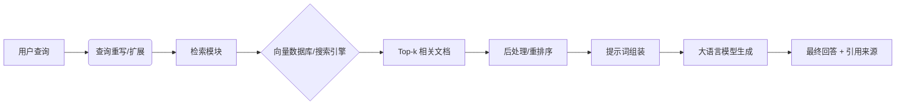

# RAG 技术 研究报告

**研究类型**: 技术
**生成时间**: 2026-06-28 21:28:15
**模型**: deepseek-v4-pro
**WebSearch**: 启用

---

## 研究概述

技术调研，了解最新技术发展、框架、工具

本研究重点关注：技术概述, 主流方案, 优缺点对比, 应用场景, 发展趋势

---

## 执行摘要

本研究包含 1 个研究维度，累计使用 5,251 tokens 进行分析，收集了 26 个信息来源。

### 关键发现

- 检索增强生成（Retrieval-Augmented Generation, RAG）是一种将**信息检索**与**大语言模型生成**相结合的技术范式。其核心思想是：在 LLM 回答问题前，先从外部知识库（如维基百科、企业文档）中检索相关片段，然后将这些片段作为上下文与问题一起输入模型，从而提升回答的事实准确性、时效性和领域专业性，有效缓解幻觉（hallucination）和知识截止问题。
- > **首次正式提出**：Lewis 等人 2020 年的论文，将预训练的检索器与序列到序列生成器端到端联合微调，并命名为 RAG。
- 典型的 RAG 系统包含以下步骤：
- ```mermaid
- graph LR

---


# RAG（检索增强生成）技术深度研究报告

## 1. 什么是 RAG？

检索增强生成（Retrieval-Augmented Generation, RAG）是一种将**信息检索**与**大语言模型生成**相结合的技术范式。其核心思想是：在 LLM 回答问题前，先从外部知识库（如维基百科、企业文档）中检索相关片段，然后将这些片段作为上下文与问题一起输入模型，从而提升回答的事实准确性、时效性和领域专业性，有效缓解幻觉（hallucination）和知识截止问题。

> **首次正式提出**：Lewis 等人 2020 年的论文，将预训练的检索器与序列到序列生成器端到端联合微调，并命名为 RAG。

## 2. RAG 工作流程与核心架构

典型的 RAG 系统包含以下步骤：



- **索引（Indexing）**：将文档分割为块（chunks），通过嵌入模型（如 `text-embedding-ada-002`、`BGE`、`E5`）转换为向量，存入向量数据库。
- **检索（Retrieval）**：对用户查询进行编码，采用相似度搜索（余弦相似度）从库中获取 top-k 文档。常用策略包括：
    - **稀疏检索**：BM25，基于词频。
    - **稠密检索**：基于 Transformer 的双塔模型（如 DPR）。
    - **混合检索**：结合稀疏与稠密，取长补短。
- **增强（Augmentation）**：将检索到的文档与原始查询拼接，形成增强提示词。可选步骤包括：重排序（Re-rank）、上下文压缩、融合多个段落。
- **生成（Generation）**：LLM 基于增强后上下文生成最终回答，通常要求模型附带引用标记。

### 2.1 RAG 的三种范式
根据 [Gao 等人的综述 (2023)](https://arxiv.org/abs/2312.10997)，RAG 的发展可分为三个阶段：
- **朴素 RAG (Naive RAG)**：经典的“检索-阅读”流程，简单拼接，无额外处理。
- **高级 RAG (Advanced RAG)**：引入查询重写、混合检索、重排序、上下文压缩等优化，提升检索质量。
- **模块化 RAG (Modular RAG)**：将 RAG 系统解耦为可组合模块（如检索、记忆、推理、调度），通过编排实现复杂功能，例如结合图结构、知识图谱或在生成中动态决定何时检索。

## 3. 关键论文与演进时间线

### 3.1 奠基与早期探索

#### Retrieval-Augmented Generation for Knowledge-Intensive NLP Tasks
- **来源**: NeurIPS 2020, arXiv:2005.11401
- **作者**: Patrick Lewis et al. (Facebook AI Research)
- **链接**: https://arxiv.org/abs/2005.11401
- **核心贡献**: 首次提出 RAG 概念。使用 DPR 作为检索器，BART 作为生成器，联合微调检索器和生成器。模型在 Natural Questions、WebQuestions 等基准上显著优于纯参数记忆模型。

#### Dense Passage Retrieval for Open-Domain Question Answering
- **来源**: EMNLP 2020, arXiv:2004.04906
- **作者**: Vladimir Karpukhin et al.
- **链接**: https://arxiv.org/abs/2004.04906
- **核心贡献**: 提出 DPR（稠密段落检索），使用双塔 BERT 编码查询和文档，在开放域问答中大幅超越 BM25。成为多数 RAG 系统的标准检索组件。

#### REALM: Retrieval-Augmented Language Model Pre-Training
- **来源**: ICML 2020, arXiv:2002.08909
- **作者**: Kelvin Guu et al. (Google)
- **链接**: https://arxiv.org/abs/2002.08909
- **核心贡献**: 在**预训练阶段**引入检索增强，语言模型通过从知识语料库中检索并预测掩码词，使模型参数知识与检索知识在预训练中融合，具有“终身学习”潜力。

#### Leveraging Passage Retrieval with Generative Models for Open Domain Question Answering
- **来源**: EACL 2021, arXiv:2007.01282
- **作者**: Gautier Izacard, Edouard Grave (Facebook AI Research)
- **链接**: https://arxiv.org/abs/2007.01282
- **核心贡献**: 提出 **Fusion-in-Decoder (FiD)** 架构。将检索到的多篇文档独立编码，在解码器中拼接所有隐藏状态并融合生成。这种方法允许生成器利用来自不同文档的证据组合，在 TriviaQA 等任务上达到 SOTA。

### 3.2 大规模与专业化 RAG

#### Improving Language Models by Retrieving from Trillions of Tokens (RETRO)
- **来源**: ICML 2022, arXiv:2112.04426
- **作者**: Sebastian Borgeaud et al. (DeepMind)
- **链接**: https://arxiv.org/abs/2112.04426
- **核心贡献**: 将检索增强与巨型 Transformer 解耦。基于 70 亿参数模型，从 2 万亿 token 数据库中检索邻居 chunk，通过 chunked cross-attention 注入生成。性能与参数量大 25 倍的 GPT-3 相当，展示了检索对降低模型大小的潜力。

#### ATLAS: Few-shot Learning with Retrieval Augmented Models
- **来源**: JMLR 2023 (初版 arXiv:2208.03299)
- **作者**: Gautier Izacard et al. (Meta AI)
- **链接**: https://arxiv.org/abs/2208.03299
- **核心贡献**: 研究检索增强模型在大规模少样本学习场景中的表现。架构基于 FiD，使用持续预训练结合检索器微调，仅用 64 个示例就在 QA 任务上达到 SOTA。

### 3.3 反思、纠正与主动检索

#### Self-RAG: Learning to Retrieve, Generate, and Critique through Self-Reflection
- **来源**: ICLR 2024 亮点论文, arXiv:2310.11511
- **作者**: Akari Asai et al. (University of Washington)
- **链接**: https://arxiv.org/abs/2310.11511
- **核心贡献**: 训练语言模型自适应地检索段落，并在生成过程中生成反思标记（reflection tokens），用于判断检索内容的相关性、支持度与有用性。模型在需要时应“按需检索”，并能批判自己的输出，显著提高了事实准确性和引用质量。

#### Corrective Retrieval Augmented Generation
- **来源**: arXiv:2401.15884 (2024)
- **作者**: Shi-Qi Yan et al.
- **链接**: https://arxiv.org/abs/2401.15884
- **核心贡献**: 提出 CRAG，在检索后引入一个轻量级的**检索评估器**，对检索文档的可信度打分。若置信度低，自动触发网页搜索（纠正检索），并将优化后的知识注入生成，在多个数据集上提高了鲁棒性。

#### Active Retrieval Augmented Generation (FLARE)
- **来源**: EMNLP 2023, arXiv:2305.06983
- **作者**: Zhengbao Jiang et al. (CMU)
- **链接**: https://arxiv.org/abs/2305.06983
- **核心贡献**: 提出前瞻性主动检索策略。在 LLM 生成过程中，当模型对下一个句子不确定（低概率词）时，主动使用当前生成的句子作为查询去检索，实现生成与检索的迭代交错，适合长篇知识密集型文本。

### 3.4 结构化与图增强 RAG

#### RAPTOR: Recursive Abstractive Processing for Tree-Organized Retrieval
- **来源**: ICLR 2024, arXiv:2401.18059
- **作者**: Parth Sarthi et al. (Stanford)
- **链接**: https://arxiv.org/abs/2401.18059
- **核心贡献**: 改变传统仅检索短文段的做法，通过递归聚类和摘要构建**树状索引**。检索时可以在不同抽象层级（高层主题或细节描述）获取上下文，克服了扁平分块导致的上下文割裂问题。

#### From Local to Global: A Graph RAG Approach to Query-Focused Summarization (GraphRAG)
- **来源**: arXiv:2404.16130 (2024)
- **作者**: Darren Edge et al. (Microsoft)
- **链接**: https://arxiv.org/abs/2404.16130
- **核心贡献**: 使用 LLM 从私有文档中构建**知识图谱**（实体、关系、社区），再生成社区摘要。回答查询时，结合社区摘要进行全局搜索，或遍历图进行局部检索。在复杂信息整合和全局理解任务上超越朴素 RAG。

### 3.5 综述与基准

#### Retrieval-Augmented Generation for Large Language Models: A Survey
- **来源**: arXiv:2312.10997 (2023)
- **作者**: Yunfan Gao et al.
- **链接**: https://arxiv.org/abs/2312.10997
- **核心贡献**: 全面综述 RAG 的技术演化，分为朴素、高级、模块化三大范式，系统总结了检索、生成、增强模块的优化方法，并提供了评估体系与未来展望。

#### A Survey on RAG Meeting LLMs: Towards Retrieval-Augmented Large Language Models
- **来源**: arXiv:2405.06211 (2024)
- **作者**: Wenqi Zhao et al.
- **链接**: https://arxiv.org/abs/2405.06211
- **核心贡献**: 与 Gao 等人的综述互补，更聚焦于 RAG 与 LLM 结合时的工程架构、效率优化和多模态融合，并梳理了最新的工业级平台。

#### RAGAS: Automated Evaluation of Retrieval Augmented Generation
- **来源**: arXiv:2309.15217 (2023)
- **作者**: Shahul ES et al. (Exploding Gradients)
- **链接**: https://arxiv.org/abs/2309.15217
- **核心贡献**: 提出无需人工标注的 RAG 评估框架 RAGAS，核心指标包括：忠实度（Faithfulness）、答案相关性（Answer Relevancy）、上下文精确率（Context Precision）、上下文召回率（Context Recall）。已成为 RAG 系统开发的标准评估工具。

## 4. 主流框架与工具生态

| 框架/工具 | 类型 | 核心特性 | 链接 |
| :--- | :--- | :--- | :--- |
| **LangChain** | 编排框架 | 模块化链式调用，丰富的检索器、LLM 接口和 Agents；社区庞大。 | [官网](https://www.langchain.com/) |
| **LlamaIndex** | 数据框架 | 专注数据连接与索引，支持各类文档加载、解析、索引结构（树、图、关键词表），天然为 RAG 设计。 | [官网](https://www.llamaindex.ai/) |
| **Haystack** | 端到端框架 | deepset 开发，成熟的 Pipeline 架构，支持检索、生成、评估一体化，适用于生产环境。 | [GitHub](https://github.com/deepset-ai/haystack) |
| **Dify** | 低代码平台 | 可视化编排 RAG 流水线，集成了关键技术优化（如混合检索、重排序），支持模型管理。 | [GitHub](https://github.com/langgenius/dify) |
| **RAGFlow** | 开源引擎 | 基于深度文档理解，提供智能分块、知识图谱构建和可信赖引用，面向复杂文档格式。 | [GitHub](https://github.com/infiniflow/ragflow) |
| **FastGPT** | 知识库平台 | 基于 LLM 的可视化工作流，快速搭建知识问答机器人，支持 Flow 编排。 | [GitHub](https://github.com/labring/FastGPT) |
| **Chroma** | 向量数据库 | 轻量级、嵌入式向量数据库，适合原型开发。 | [官网](https://www.trychroma.com/) |
| **FAISS** | 向量检索库 | Meta 出品，高效相似性搜索，支持 GPU，底层库，非完整数据库。 | [GitHub](https://github.com/facebookresearch/faiss) |
| **Milvus** | 向量数据库 | 云原生、分布式，高可用，支持十亿级向量，性能强劲。 | [官网](https://milvus.io/) |
| **Weaviate** | 向量数据库 | 原生支持混合搜索（向量+标量），GraphQL 接口，内置模块化 Embedding 组件。 | [官网](https://weaviate.io/) |
| **Qdrant** | 向量数据库 | Rust 编写，高性能，支持过滤、分组，提供丰富的客户端和云服务。 | [官网](https://qdrant.tech/) |
| **Pinecone** | 向量数据库 | 全托管云服务，运维成本低，适用于快速上线的商业应用。 | [官网](https://www.pinecone.io/) |

## 5. 主要挑战与应对方案

### 5.1 检索质量欠佳
- **问题**：返回的文档与查询不相关，或遗漏关键信息。
- **解决方案**：
    - 查询重写（Query Rewriting）：用 LLM 分解复杂问题为子问题。
    - 混合检索 + 重排序（Rerank）：先粗筛再精排，如使用 `BGE-Reranker`。
    - 晚期交互模型（Late Interaction）：如 ColBERT，保留部分 token 级交互。
    - 多步检索与自省：如 Self-RAG，让模型判断检索是否充足。

### 5.2 上下文整合与“中间丢失”（Lost in the Middle）
- **问题**：LLM 在处理长上下文时，对中间位置的文档关注度低；大量无关文档稀释关键信息。
- **解决方案**：
    - 重排序确保最相关文档处于开头或结尾。
    - 上下文压缩（Context Compression）：用小型模型总结或过滤文档，再喂给生成器。
    - 分层索引与摘要：如 RAPTOR，将文档概括为多级摘要，让模型先看概要再调取细节。

### 5.3 生成忠实度与幻觉
- **问题**：模型可能忽略检索到的文档，或编造文档中不存在的信息。
- **解决方案**：
    - 训练模型严格基于检索证据生成，并在输出中标注引用。
    - 推理阶段使用 Self-RAG 的反思标记进行自我检查。
    - 后处理检错：用 NLI 模型验证生成陈述是否被检索文档蕴含。

### 5.4 延迟与成本
- **问题**：实时的检索、重排序和长提示词导致推理延迟高、API 成本大。
- **解决方案**：
    - 缓存机制：缓存常见查询的检索结果或最终答案。
    - 使用轻量级嵌入模型和向量数据库优化检索速度。
    - 投机性检索：在生成早期句子的同时并行启动下一轮检索。

### 5.5 评估与数据集
- **问题**：人工评估成本高，自动化指标难以捕捉语义忠实度。
- **常用基准与工具**：
    - **RAGAS**（前述）：自动化评估。
    - **RGB Benchmark** (Chen et al., 2023): 中文 RAG 综合基准。
    - **ARES** (Santhanam et al., 2023): 通过微调分类器与少样本学习评估 RAG 指标。

## 6. 2024 年前沿趋势

### 6.1 Agentic RAG（智能体 RAG）
将 LLM 作为 Agent，动态规划检索策略。例如，根据问题类型选择不同知识库，调用搜索 API、计算器、代码解释器等工具；检索 → 阅读 → 生成 → 核对 → 修正，形成闭环。这使 RAG 从一次性流水线转变为**目标驱动的自适应系统**。

### 6.2 Graph RAG（图增强 RAG）
利用知识图谱（KG）或文档层级图增强上下文理解。Microsoft GraphRAG 是典型代表。相比扁平向量检索，图结构能更好地捕捉实体间关系，回答如“总结整个文档集的主要主题”这类全局性、聚合性问题，效果远超朴素 RAG。

### 6.3 多模态 RAG
检索内容从纯文本扩展到图像、表格、音视频等。例如，问“2024 年销量趋势”，RAG 可以从 PDF 中检索到图表，或将表格数据输入 LLM 进行推理。模型需要理解多种模态并建立跨模态关联。

### 6.4 长上下文 LLM vs. RAG
GPT-4 Turbo（128K）、Claude 3（200K）等支持超长上下文窗口，引发“长上下文是否会取代 RAG”的讨论。目前共识是**互补关系**：RAG 在精确匹配特定文档、快速更新知识、避免上下文污染和降低推理成本方面仍有优势；而长上下文更擅长处理整个文档结构、长程推理。未来“检索后长上下文读取（长文档级）”的结合将成为主流。例如，先用检索筛选相关文档，再将整篇文档或长片段提供给 LLM。

### 6.5 端到端训练与推理优化
从独立组件组合，走向对 RAG 整个流程进行端到端训练（如使用强化学习训练检索器以提高下游任务性能），或在推理阶段动态选择检索时机与检索深度，最大程度减少无效检索带来的开销。

## 7. 总结与展望

RAG 技术已从简单的“检索 + 生成”原型，发展为融合结构化索引、自我反思、图推理和智能体调度的综合性知识增强框架。**核心矛盾始终是检索准确性、生成忠实度与系统效率之间的平衡。**

未来，随着跨模态理解、知识图谱深度融合以及小型化高性能模型的发展，RAG 将变得更具适应性、可靠性和可解释性，成为大模型连接世界知识的事实标准接口。

---
**温馨提示**：RAG 领域发展迅速，本报告基于截至 2024 年中的公开研究成果与工业实践。建议持续关注 arXiv 上“Computation and Language”分类及各大 AI 实验室的技术博客。

## 信息来源

- [Gao 等人的综述 (2023)](https://arxiv.org/abs/2312.10997) (arXiv:2312.10997)

- [https://arxiv.org/abs/2005.11401](https://arxiv.org/abs/2005.11401) (arXiv:2005.11401)

- [https://arxiv.org/abs/2004.04906](https://arxiv.org/abs/2004.04906) (arXiv:2004.04906)

- [https://arxiv.org/abs/2002.08909](https://arxiv.org/abs/2002.08909) (arXiv:2002.08909)

- [https://arxiv.org/abs/2007.01282](https://arxiv.org/abs/2007.01282) (arXiv:2007.01282)

- [https://arxiv.org/abs/2112.04426](https://arxiv.org/abs/2112.04426) (arXiv:2112.04426)

- [https://arxiv.org/abs/2208.03299](https://arxiv.org/abs/2208.03299) (arXiv:2208.03299)

- [https://arxiv.org/abs/2310.11511](https://arxiv.org/abs/2310.11511) (arXiv:2310.11511)

- [https://arxiv.org/abs/2401.15884](https://arxiv.org/abs/2401.15884) (arXiv:2401.15884)

- [https://arxiv.org/abs/2305.06983](https://arxiv.org/abs/2305.06983) (arXiv:2305.06983)

- [https://arxiv.org/abs/2401.18059](https://arxiv.org/abs/2401.18059) (arXiv:2401.18059)

- [https://arxiv.org/abs/2404.16130](https://arxiv.org/abs/2404.16130) (arXiv:2404.16130)

- [https://arxiv.org/abs/2405.06211](https://arxiv.org/abs/2405.06211) (arXiv:2405.06211)

- [https://arxiv.org/abs/2309.15217](https://arxiv.org/abs/2309.15217) (arXiv:2309.15217)

- [官网](https://www.langchain.com/)

- [官网](https://www.llamaindex.ai/)

- [GitHub](https://github.com/deepset-ai/haystack)

- [GitHub](https://github.com/langgenius/dify)

- [GitHub](https://github.com/infiniflow/ragflow)

- [GitHub](https://github.com/labring/FastGPT)

- [官网](https://www.trychroma.com/)

- [GitHub](https://github.com/facebookresearch/faiss)

- [官网](https://milvus.io/)

- [官网](https://weaviate.io/)

- [官网](https://qdrant.tech/)

- [官网](https://www.pinecone.io/)

---

---

## 研究元数据

- **Prompt Tokens**: 340
- **Completion Tokens**: 4911
- **Total Tokens**: 5251
- **Reasoning Tokens**: 801

- **研究时间**: 2026-06-28T21:28:15.517034
- **使用模型**: deepseek-v4-pro
- **WebSearch**: 已启用
