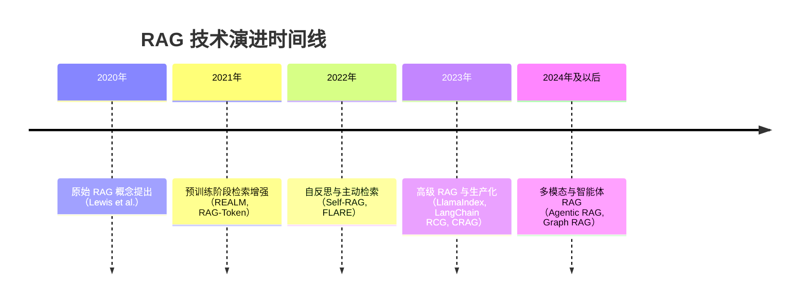
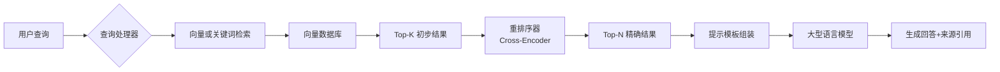

# RAG 技术 研究报告

**研究类型**: 技术
**生成时间**: 2026-06-28 21:30:34
**模型**: deepseek-v4-pro
**WebSearch**: 启用

---

## 研究概述

技术调研，了解最新技术发展、框架、工具

本研究重点关注：技术概述, 主流方案, 优缺点对比, 应用场景, 发展趋势

---

## 执行摘要

本研究包含 1 个研究维度，累计使用 4,417 tokens 进行分析，收集了 25 个信息来源。

### 关键发现

- 检索增强生成（Retrieval-Augmented Generation, RAG）是一种将信息检索系统与大型语言模型（LLM）相融合的混合架构。其核心思想在于：在生成回答之前，模型首先从外部知识库（如文档集合、数据库、网页）中检索相关信息片段，然后将这些片段作为额外的上下文输入到生成模型中，以产生更准确、更具事实依据、时效性更强的输出。RAG 的出现直接回应了 LLM 面临的两大核心挑战：**知识截断**（模型训练数据有截止日期）和**幻觉**（模型生成虚假事实）。
- 相比于单纯扩大模型参数量或仅依赖微调来注入知识，RAG 提供了一种更灵活、可解释且成本效益更高的知识扩充方案。它允许模型动态查询最新数据，无需重新训练即可更新知识，并在一定程度上为生成的回答提供了可溯源的事实依据。
- RAG 技术的演进可划分为几个关键阶段，以下为重要里程碑：
- ```mermaid
- timeline

---


# 检索增强生成（RAG）技术深度研究报告

## 1. 引言与核心定义

检索增强生成（Retrieval-Augmented Generation, RAG）是一种将信息检索系统与大型语言模型（LLM）相融合的混合架构。其核心思想在于：在生成回答之前，模型首先从外部知识库（如文档集合、数据库、网页）中检索相关信息片段，然后将这些片段作为额外的上下文输入到生成模型中，以产生更准确、更具事实依据、时效性更强的输出。RAG 的出现直接回应了 LLM 面临的两大核心挑战：**知识截断**（模型训练数据有截止日期）和**幻觉**（模型生成虚假事实）。

相比于单纯扩大模型参数量或仅依赖微调来注入知识，RAG 提供了一种更灵活、可解释且成本效益更高的知识扩充方案。它允许模型动态查询最新数据，无需重新训练即可更新知识，并在一定程度上为生成的回答提供了可溯源的事实依据。

## 2. 发展历程与关键里程碑

RAG 技术的演进可划分为几个关键阶段，以下为重要里程碑：



### 2.1 奠基性论文

#### 📄 Retrieval-Augmented Generation for Knowledge-Intensive NLP Tasks
- **来源**: NeurIPS 2020; arXiv:2005.11401
- **作者**: Patrick Lewis, Ethan Perez, Aleksandra Piktus, et al.
- **链接**: [https://arxiv.org/abs/2005.11401](https://arxiv.org/abs/2005.11401)
- **核心贡献**: 首次提出了 RAG 框架，将预训练的检索器（Dense Passage Retrieval, DPR）与预训练的序列到序列生成器（BART）结合，在知识密集型任务（如开放域问答）上大幅提升了性能，并具备知识更新和可解释来源的优点。该论文定义了 RAG-Sequence 和 RAG-Token 两种模型形式，为后续研究奠定基础。

### 2.2 预训练阶段的检索增强

#### 📄 REALM: Retrieval-Augmented Language Model Pre-Training
- **来源**: ICML 2020; arXiv:2002.08909
- **作者**: Kelvin Guu, Kenton Lee, Zora Tung, et al.
- **链接**: [https://arxiv.org/abs/2002.08909](https://arxiv.org/abs/2002.08909)
- **核心贡献**: REALM 提出在语言模型预训练过程中即引入检索机制，通过一种可微的知识检索器从大型文本语料库中检索相关文档，将检索和掩码语言建模任务联合训练，从而将世界知识更深入地嵌入模型参数。

### 2.3 自反思与主动检索

#### 📄 Self-RAG: Learning to Retrieve, Generate, and Critique through Self-Reflection
- **来源**: arXiv:2310.11511 (2023)
- **作者**: Akari Asai, Zeqiu Wu, Yizhong Wang, et al.
- **链接**: [https://arxiv.org/abs/2310.11511](https://arxiv.org/abs/2310.11511)
- **核心贡献**: Self-RAG 在生成阶段动态决定是否需要检索，并生成“反思标记”（如`[Relevant]`、`[Supported]`、`[Partially Answered]`）来评估检索结果和生成内容的质量，实现按需检索和自我纠正，显著提升了事实准确性和引用忠实度。

#### 📄 Active Retrieval Augmented Generation (FLARE)
- **来源**: arXiv:2305.06983 (2023)
- **作者**: Zhengbao Jiang, Frank F. Xu, Luyu Gao, et al.
- **链接**: [https://arxiv.org/abs/2305.06983](https://arxiv.org/abs/2305.06983)
- **核心贡献**: 提出在生成过程中主动预测下一句，若置信度低则触发检索未来的相关信息，实现前瞻性的主动检索，特别适用于长文本生成任务。

### 2.4 提升鲁棒性与准确性

#### 📄 Corrective Retrieval Augmented Generation (CRAG)
- **来源**: arXiv:2401.15884 (2024)
- **作者**: Shi-Qi Yan, Jia-Chen Gu, Yu Zhu, et al.
- **链接**: [https://arxiv.org/abs/2401.15884](https://arxiv.org/abs/2401.15884)
- **核心贡献**: 设计了一个轻量级检索评估器来评估检索结果的质量，当评估为“不相关”、“不准确”时，自动触发知识精炼或外部知识搜索（如 Web 搜索），从而大幅提高 RAG 系统对低质量检索的鲁棒性。

---

## 3. 核心架构组件与工作流程

一个标准的 RAG 系统由两个主要阶段构成：**索引阶段**（离线）和**查询生成阶段**（在线）。

### 3.1 索引阶段

1.  **文档加载与解析**：从多种数据源（PDF、HTML、数据库）加载原始文档。
2.  **文本分割**：将长文档分割成适当大小的文本块（chunks）。分割策略（固定长度、基于句子的分割、语义分割）直接影响检索粒度。
3.  **向量化**：利用嵌入模型（如 OpenAI `text-embedding-ada-002`，BGE，E5）将每个文本块转换为高维向量。
4.  **存储与索引**：将向量和原始文本元数据存入向量数据库（如 Pinecone, Milvus, Weaviate, Chroma），并建立近似最近邻（ANN）索引以支持快速检索。

### 3.2 查询与生成阶段

1.  **查询处理**：用户查询可能经过路由、重写或分解，以提升检索精度。
2.  **检索**：将查询向量化后，在向量数据库中检索 Top-K 个最相似的文本块。**高级检索**可能融合稀疏检索（如 BM25）形成混合检索，或经历多跳检索（如基于图的检索）。
3.  **重排序**：使用交叉编码器（cross-encoder）对初步检索结果进行精确重排序，进一步提升相关度。
4.  **上下文组合**：将检索到的文本块与用户原始查询、提示模板（prompt template）融合，形成最终的 LLM 输入。
5.  **生成**：LLM 基于增强后的上下文生成回答，通常可附带引用来源。



---

## 4. 关键变体与范式分类

RAG 技术已衍生出多种范式，可根据检索和生成的协同方式进行分类：

| 范式 | 特点 | 代表性工作 |
| :--- | :--- | :--- |
| **Naive RAG** | 单次检索-生成流水线，无反馈或控制 | 原始 RAG 论文基本流程 |
| **Advanced RAG** | 引入查询重写、混合检索、重排序等优化策略以提升质量 | 多数生产系统（LangChain, LlamaIndex）默认实现 |
| **Modular RAG** | 功能模块化，可灵活组合检索、记忆、路由、融合等组件 | Wang et al. "Modular RAG Survey" (2024) |
| **Self-RAG** | 模型自主决定何时检索，并通过自反思标记评估检索和生成质量 | Self-RAG, CRAG |
| **Graph RAG** | 利用知识图谱或图数据库进行检索，理解实体间关系，解决“总结大主题”类问题 | Microsoft GraphRAG, Neo4j 相关应用 |
| **Agentic RAG** | 将 RAG 视为智能体（Agent）的一个工具，可在多步骤推理中动态规划、检索、验证、整合 | LangChain Agents, LlamaIndex Agents |

### 4.1 高级 RAG 优化策略摘要

引用来源：[Gao et al. "Retrieval-Augmented Generation for Large Language Models: A Survey"](https://arxiv.org/abs/2312.10997) (arXiv:2312.10997)

- **查询优化**：**查询重写**（Query2Doc, HyDE）、**子查询分解**（Least-to-Most）、**Step-Back Prompting**（回溯提示，从抽象概念检索）。
- **检索优化**：**混合检索**（密集向量 + BM25 稀疏检索）、**递归检索**（基于小块检索，返回大块上下文）、**多粒度索引**（句子级和文档级索引并行）。
- **生成优化**：**上下文压缩**（LLMLingua）、**注意力聚焦**（Prompt Compression）、**引用规范**（强制模型为每个陈述提供来源）。

---

## 5. 主流工具与框架

目前，RAG 生态系统已十分丰富，主要分为两类：编排框架和向量数据库。

### 5.1 编排框架

| 框架名称 | 主要特点与优势 | 文档/仓库链接 |
| :--- | :--- | :--- |
| **LangChain** | 最成熟的 LLM 应用开发框架，提供标准化接口，支持丰富的 LLM、检索器、链和智能体，社区庞大。 | [https://python.langchain.com/](https://python.langchain.com/) / [GitHub](https://github.com/langchain-ai/langchain) |
| **LlamaIndex** | 专为数据增强（索引和检索）设计的框架，提供强大的数据连接器、灵活的分块/嵌入策略和高级查询引擎（如递归检索、子问题查询）。 | [https://docs.llamaindex.ai/](https://docs.llamaindex.ai/) / [GitHub](https://github.com/run-llama/llama_index) |
| **Haystack** | 由 deepset 维护，以流水线灵活性著称，组件可组合性强，支持从原型到生产的完整流水线构建。 | [https://haystack.deepset.ai/](https://haystack.deepset.ai/) / [GitHub](https://github.com/deepset-ai/haystack) |
| **Dify** | 开源 LLMOps 平台，提供可视化编排界面，支持 RAG 流水线、Agent、工作流定义，易于非开发者使用。 | [https://dify.ai/](https://dify.ai/) / [GitHub](https://github.com/langgenius/dify) |

### 5.2 向量数据库与检索引擎

| 工具 | 类型 | 核心特性 | 链接 |
| :--- | :--- | :--- | :--- |
| **Chroma** | 开源嵌入式向量数据库 | 开发者友好，轻量级，易于上手，适合原型开发。 | [https://www.trychroma.com/](https://www.trychroma.com/) |
| **Pinecone** | 全托管向量数据库 | 高性能，低延迟，运维代价低，适合生产级应用。 | [https://www.pinecone.io/](https://www.pinecone.io/) |
| **Weaviate** | 开源向量数据库 | 支持混合搜索（关键词+向量），内置模块化架构，可集成多种模型。 | [https://weaviate.io/](https://weaviate.io/) |
| **Milvus** | 开源云原生向量数据库 | 高可扩展性强，支持百万级向量处理，适用于大规模生产环境。 | [https://milvus.io/](https://milvus.io/) |
| **Elasticsearch** | 分布式搜索与分析引擎 | 通过 kNN 插件支持向量检索，可与强大的 BM25 稀疏检索无缝组合混合搜索。 | [https://www.elastic.co/](https://www.elastic.co/) |
| **FAISS** | 高效相似性搜索库 | Meta 开源，GPU 加速，用于向量索引和聚类的底层算法库，非独立数据库。 | [https://github.com/facebookresearch/faiss](https://github.com/facebookresearch/faiss) |

---

## 6. 当前挑战与局限

尽管 RAG 效果显著，但在实际落地中仍面临一系列核心挑战：

1.  **检索质量瓶颈**：检索召回率低、精度差，或未能检索到关键信息，直接制约最终答案质量。特别是当文档语义空间与用户问题不匹配时。
2.  **长下文整合作战**：如何将大量检索到的片段有效整合进 LLM 的有限上下文窗口，避免“中间丢失”（Lost in the Middle）现象，需要精细的上下文排序和压缩策略。
3.  **多跳推理断层**：需要从多个分散文档中组合信息才能回答的复杂问题，系统往往难以捕捉实体间的跨文档链接。
4.  **幻觉与溯源忠实性**：即使有检索支持，LLM 仍可能生成与检索文档不符的陈述（忠实性幻觉），或错误引用来源。
5.  **评估体系不完善**：缺乏统一、标准的自动化评估指标来综合评价答案的**忠实性**、**相关性**和**准确性**。主流评测集（如 RGB， RAGAS）仍在发展中。
6.  **面向领域的适配成本**：在专业领域（医疗、法律、金融）中，通用嵌入模型和分块策略往往需要大量定制化调优。
7.  **生产系统的复杂性与鲁棒性**：需要处理数据更新、文档解析失败、检索超时、成本控制、安全防护等大量工程问题。

### 6.1 相关研究支持

- **Lost in the Middle 现象**：[Liu et al. "Lost in the Middle: How Language Models Use Long Contexts"](https://arxiv.org/abs/2307.03172) (arXiv:2307.03172)：研究发现，LLM 对位于上下文窗口开头和结尾的信息利用最好，中间位置的信息容易被忽略，需调整排序策略。
- **RAG 评估**：[Es et al. "RAGAS: Automated Evaluation of Retrieval Augmented Generation"](https://arxiv.org/abs/2309.15217) (arXiv:2309.15217)：提出了一个无需人工标注的自动评测框架 RAGAS，通过忠实度、答案相关性、上下文召回率等指标评估 RAG 系统。
- **幻觉问题**：[Li et al. "A Survey of Hallucination in Large Foundation Models"](https://arxiv.org/abs/2309.05922) (arXiv:2309.05922) 深入分析了 LLM 幻觉的类型和成因，其中指出检索增强是一种有效的缓解策略，但无法根除。

---

## 7. 未来趋势

### 7.1 智能体 RAG（Agentic RAG）
RAG 将超越简单的线性流水线，演变为由智能体驱动的动态过程。智能体能够进行多步骤推理，自主决定何时检索、检索什么、如何整合信息，甚至使用外部工具（如计算器、API）来完成任务。多智能体系统可以协作解决更复杂的查询。

### 7.2 多模态 RAG
将检索范围从纯文本扩展至图像、表格、音频、视频等多模态数据。例如，检索技术手册中的示意图来回答操作问题。这要求具备统一的多模态嵌入和生成能力。[Zhou et al. "UniRAG: Universal Retrieval Augmentation for Multi-Modal Large Language Models"](https://arxiv.org/abs/2405.14955) (arXiv:2405.14955) 探索了此类方向。

### 7.3 从增强到生成更紧密的融合
未来 LLM 可能原生支持检索，即模型在预训练时就内建了检索功能，使得生成和检索在表征层面深度对齐，而非当前松耦合的方式。如 RETRO（Retrieval-Enhanced Transformer）[Borgeaud et al. "Improving language models by retrieving from trillions of tokens"](https://arxiv.org/abs/2112.04426) (arXiv:2112.04426) 所做的探索。

### 7.4 可解释性与溯源保障
用户对 AI 信任的前提是可验证。未来 RAG 系统将提供更细粒度的溯源，精确到句子或论点级别的引用，并利用辩论、验证链等技术确保最终答案的可信度。

### 7.5 边缘端与实时 RAG
小型化检索与生成模型的发展，将使 RAG 在端侧设备上运行成为可能，结合本地私有数据，实现隐私保护、低延迟、高实时性的个性化智能助手。

---

## 8. 总结

RAG 技术已从一种前沿研究原型快速进化为 LLM 产业应用的核心基础设施，它通过动态连接外部知识库，显著缓解了 LLM 的知识局限性。当前的研发重点正从基础的“检索-生成”框架转向提升系统的**鲁棒性**、**智能性**（自反思、主动检索）和**可部署性**。未来，RAG 将更深度地与智能体、多模态和边缘计算结合，成为构建可信、可追溯、实时更新的人工智能系统的关键支柱。

> 本报告基于截至 2025 年 4 月的公开学术论文、技术博客和开源项目信息整理而成。AI 领域发展迅速，建议持续关注新增研究成果。

## 信息来源

- [https://arxiv.org/abs/2005.11401](https://arxiv.org/abs/2005.11401) (arXiv:2005.11401)

- [https://arxiv.org/abs/2002.08909](https://arxiv.org/abs/2002.08909) (arXiv:2002.08909)

- [https://arxiv.org/abs/2310.11511](https://arxiv.org/abs/2310.11511) (arXiv:2310.11511)

- [https://arxiv.org/abs/2305.06983](https://arxiv.org/abs/2305.06983) (arXiv:2305.06983)

- [https://arxiv.org/abs/2401.15884](https://arxiv.org/abs/2401.15884) (arXiv:2401.15884)

- [Gao et al. "Retrieval-Augmented Generation for Large Language Models: A Survey"](https://arxiv.org/abs/2312.10997) (arXiv:2312.10997)

- [https://python.langchain.com/](https://python.langchain.com/)

- [GitHub](https://github.com/langchain-ai/langchain)

- [https://docs.llamaindex.ai/](https://docs.llamaindex.ai/)

- [GitHub](https://github.com/run-llama/llama_index)

- [https://haystack.deepset.ai/](https://haystack.deepset.ai/)

- [GitHub](https://github.com/deepset-ai/haystack)

- [https://dify.ai/](https://dify.ai/)

- [GitHub](https://github.com/langgenius/dify)

- [https://www.trychroma.com/](https://www.trychroma.com/)

- [https://www.pinecone.io/](https://www.pinecone.io/)

- [https://weaviate.io/](https://weaviate.io/)

- [https://milvus.io/](https://milvus.io/)

- [https://www.elastic.co/](https://www.elastic.co/)

- [https://github.com/facebookresearch/faiss](https://github.com/facebookresearch/faiss)

- [Liu et al. "Lost in the Middle: How Language Models Use Long Contexts"](https://arxiv.org/abs/2307.03172) (arXiv:2307.03172)

- [Es et al. "RAGAS: Automated Evaluation of Retrieval Augmented Generation"](https://arxiv.org/abs/2309.15217) (arXiv:2309.15217)

- [Li et al. "A Survey of Hallucination in Large Foundation Models"](https://arxiv.org/abs/2309.05922) (arXiv:2309.05922)

- [Zhou et al. "UniRAG: Universal Retrieval Augmentation for Multi-Modal Large Language Models"](https://arxiv.org/abs/2405.14955) (arXiv:2405.14955)

- [Borgeaud et al. "Improving language models by retrieving from trillions of tokens"](https://arxiv.org/abs/2112.04426) (arXiv:2112.04426)

---

---

## 研究元数据

- **Prompt Tokens**: 340
- **Completion Tokens**: 4077
- **Total Tokens**: 4417
- **Reasoning Tokens**: 122

- **研究时间**: 2026-06-28T21:30:34.623953
- **使用模型**: deepseek-v4-pro
- **WebSearch**: 已启用
