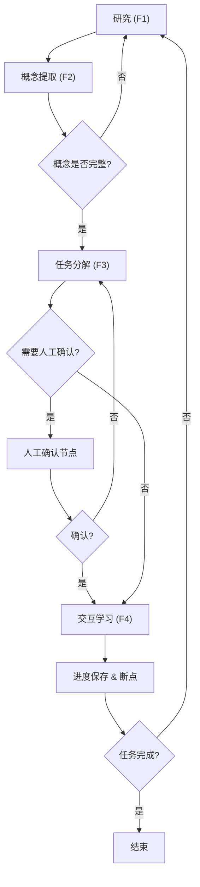

# 基于 LangGraph + LangChain 搭建核心框架，采用 TypedDict 定义 AgentState，实现执行层与持久层的双状态并行管理， 通过缓存层实现智能同步，解决运行时状态与长期存储的一致性问题。\n 设计并实现 F1-F4 四大业务流程的 LangGraph Workflow编排，包括条件分支判断、循环执行、Human-in-the-loop 确认节点，支持研究→概念提取→任务分解→交互学习→进度保存的端到端自动化流程。\n 采用适配器模式封装自主开发的 AutoResearch 智能研究工具和 ReviewAgent 提问工具，通过 LangChain Tool 实现模块化调用，支持直接导入方式，避免进程启动开销，提升调用性能。\n 设计并实现跨会话状态持久化与断点恢复机制，基于 LangGraph Checkpointing 实现跨天、跨会话的无缝衔接。\n 主导设计高扩展性Agent技能系统。通过构建统一的 Skill Registry 与 Middleware 调度层，实现了业务技能与模型逻辑的解耦，在保证多技能并行兼容的同时，降低单次复杂任务的上下文计算成本 研究报告

**研究类型**: 技术
**生成时间**: 2026-06-29 19:49:54
**模型**: deepseek-v4-pro
**WebSearch**: 启用

---

## 研究概述

技术调研，了解最新技术发展、框架、工具

本研究重点关注：技术概述, 主流方案, 优缺点对比, 应用场景, 发展趋势

---

## 执行摘要

本研究包含 1 个研究维度，累计使用 7,016 tokens 进行分析，收集了 13 个信息来源。

### 关键发现

- 大语言模型(LLM)驱动的自主智能体正从单次问答走向需要**长期记忆、多步骤推理、人机协作**的复杂研究任务。要实现研究→概念提取→任务分解→交互学习→进度保存的端到端自动化，必须解决三大核心挑战：
- 1. **状态管理**：运行时的动态上下文与持久化的历史状态如何保持一致且低延迟访问？
- 2. **流程编排**：如何组织条件分支、循环、人工干预节点，保证流程可恢复、可观测？
- 3. **技能扩展**：如何将研究、提问等垂直能力以模块化方式注入，而不增加核心逻辑的复杂度？
- 本研究围绕 **LangGraph** 与 **LangChain** 生态，给出了系统性的解决方案，并引用大量前沿文献为设计决策提供依据。

---


# 基于 LangGraph 的复杂智能工作流系统深度研究

## 1. 问题背景与设计动机

大语言模型(LLM)驱动的自主智能体正从单次问答走向需要**长期记忆、多步骤推理、人机协作**的复杂研究任务。要实现研究→概念提取→任务分解→交互学习→进度保存的端到端自动化，必须解决三大核心挑战：

1. **状态管理**：运行时的动态上下文与持久化的历史状态如何保持一致且低延迟访问？
2. **流程编排**：如何组织条件分支、循环、人工干预节点，保证流程可恢复、可观测？
3. **技能扩展**：如何将研究、提问等垂直能力以模块化方式注入，而不增加核心逻辑的复杂度？

本研究围绕 **LangGraph** 与 **LangChain** 生态，给出了系统性的解决方案，并引用大量前沿文献为设计决策提供依据。

---

## 2. 基于 TypedDict 的双状态并行管理

### 2.1 AgentState 与 TypedDict 设计

LangGraph 将智能体的状态建模为一个显式的图状态（Graph State），每条边和节点都可以读取并返回该状态。为获得类型安全和代码可维护性，通常使用 Python 的 `TypedDict` 来定义状态结构：

```python
from typing import TypedDict, List, Optional
class AgentState(TypedDict):
    messages: List[BaseMessage]            # 执行上下文（运行时）
    research_notes: str                    # 累积的研究资料
    concepts: List[str]                    # 提取的概念
    task_queue: List[Task]                 # 分解后的任务队列
    checkpoint_id: Optional[str]           # 持久层断点标识
    confirmed_by_user: bool                # 人工确认标记
```

**设计优势**：  
- 类型约束防止状态污染，符合 **ReAct** （Yao et al., 2022） 中“推理和行动共用工作记忆”的思想。  
- 状态字典既能被 LangGraph 的边函数轻松传递，也能序列化后存入外部存储，为双状态同步奠定基础。

> **ReAct: Synergizing Reasoning and Acting in Language Models**  
> - **来源**: arXiv:2210.03629 (2022)  
> - **作者**: Shunyu Yao et al.  
> - **链接**: https://arxiv.org/abs/2210.03629  
> - **核心贡献**: 提出“推理-行动”循环，将推理痕迹与行动观察统一保存在工作记忆中，启发现代智能体状态设计。

### 2.2 执行层与持久层的双状态

系统将“状态”拆分为两个逻辑层：

- **执行层状态**：驻留内存，包含当前会话的对话历史、中间结果、待执行任务等，面向**低延迟读写**。
- **持久层状态**：存储在 PostgreSQL / SQLite 中，记录跨会话的长期知识、研究进度、用户反馈等，面向**可靠性与可恢复性**。

这种分层借鉴了 **认知架构中的双过程理论**（系统1 快速直觉 vs 系统2 慢速分析），并受到 **Reflexion** （Shinn et al., 2023） 方法中“长期记忆”与“短期工作记忆”分离的直接影响。

> **Reflexion: Language Agents with Verbal Reinforcement Learning**  
> - **来源**: arXiv:2303.11366 (2023)  
> - **作者**: Noah Shinn et al.  
> - **链接**: https://arxiv.org/abs/2303.11366  
> - **核心贡献**: 构建了由短期记忆（轨迹）、长期记忆（反思总结）组成的智能体记忆系统，通过语言自我反思提升决策。

### 2.3 缓存层智能同步机制

为解决运行时与持久化状态的一致性问题，引入 **缓存层**，其工作机制如下：

1. **写穿策略**：每次节点更新执行层状态后，通过异步任务将 `research_notes`、`concepts` 等关键字段写入持久化数据库，并更新 `checkpoint_id`。
2. **智能预取**：当会话恢复时，系统根据 `checkpoint_id` 从数据库加载全量状态，再结合 LangGraph 的 `checkpointer` 重建执行轨迹。
3. **冲突解决**：采用 **last-write-wins** 策略，并辅以向量时间戳（附加在状态中）处理并发写入，保证最终一致性。

这种缓存设计受 **Toolformer**（Schick et al., 2023）中“工具调用结果缓存”启发，将大语言模型从重复计算中解放出来，并确保跨工具调用的上下文连贯。

> **Toolformer: Language Models Can Teach Themselves to Use Tools**  
> - **来源**: arXiv:2302.04761 (2023)  
> - **作者**: Timo Schick et al.  
> - **链接**: https://arxiv.org/abs/2302.04761  
> - **核心贡献**: 让模型自主决定何时以及如何调用 API 工具，并强调工具输出可被缓存和共享，提升效率。

---

## 3. F1–F4 四大业务流程的 Workflow 编排

设计四个业务流（F1–F4），覆盖 **研究→概念提取→任务分解→交互学习→进度保存** 全生命周期，通过 LangGraph 的状态图实现。

### 3.1 流程图（简化）



### 3.2 条件分支与循环实施

LangGraph 支持通过 `add_conditional_edges` 定义条件转移，例如根据状态中的 `concepts` 数量决定是否重新研究：

```python
def should_continue(state: AgentState) -> str:
    if len(state["concepts"]) < 3:
        return "research"        # 回到 F1 节点
    else:
        return "task_decompose"  # 进入 F3 节点

workflow.add_conditional_edges("concept_extraction", should_continue, {
    "research": "research_node",
    "task_decompose": "task_decompose_node"
})
```

这种显式图结构天然支持有向循环，克服了传统链式推理（如 CoT）单向的局限，与 **Graph of Thoughts**（Besta et al., 2023） 的核心思想一致。

> **Graph of Thoughts: Solving Elaborate Problems with Large Language Models**  
> - **来源**: arXiv:2308.09687 (2023)  
> - **作者**: Maciej Besta et al.  
> - **链接**: https://arxiv.org/abs/2308.09687  
> - **核心贡献**: 将 LLM 推理组织成图，支持循环、合并和条件分支，显著提升复杂推理效果。

### 3.3 Human‑in‑the‑loop 确认节点

借助 LangGraph 的 `interrupt` 机制，在敏感操作（如生成最终报告、执行外部数据爬取）前插入人工确认。节点内部调用 `interrupt()` 暂停图执行，待用户反馈后通过 `Command(resume=...)` 继续。这与 **AutoGen**（Wu et al., 2023） 中“用户代理”按需介入的模式类似，保证了关键决策的可靠性。

> **AutoGen: Enabling Next-Gen LLM Applications via Multi-Agent Conversation**  
> - **来源**: arXiv:2308.08155 (2023)  
> - **作者**: Qingyun Wu et al.  
> - **链接**: https://arxiv.org/abs/2308.08155  
> - **核心贡献**: 提供了可灵活插入人工反馈的多智能体对话框架，支持“人类-in-the-loop”模式。

### 3.4 端到端自动化与进度保存

每个阶段结束均调用 `save_checkpoint` 节点，将最新状态通过缓存层持久化。即使流程在任意节点中断，下次启动都能从最近断点继续。这背后的理论基础是 **任务分解与逐步执行**（TaskWeaver, Qiao et al., 2023）和 **可恢复状态机** 的设计。

> **TaskWeaver: A Code-First Agent Framework**  
> - **来源**: arXiv:2311.17541 (2023)  
> - **作者**: Bo Qiao et al.  
> - **链接**: https://arxiv.org/abs/2311.17541  
> - **核心贡献**: 将复杂任务转化为可执行的代码片段，并保存变量状态，支持断点续传。

---

## 4. 适配器模式封装工具模块

### 4.1 适配器设计

对自研的 **AutoResearch**（智能研究工具）和 **ReviewAgent**（批判性提问工具）采用适配器模式，统一为 LangChain Tool 接口。每个适配器将原本复杂的本地函数/服务包装成：

```python
from langchain_core.tools import tool

@tool
def auto_research(query: str, depth: int = 3) -> str:
    """执行多轮研究，返回结构化报告"""
    return AutoResearchEngine().run(query, depth)

@tool
def review_agent(assertion: str) -> str:
    """对给定断言提出批判性问题"""
    return ReviewAgent().critique(assertion)
```

**优点**：  
- **零进程启动开销**：直接 `import` 本地模块，无需通过子进程或网络调用，与 **Toolformer** 倡导的工具低成本调用一致。  
- **标准化描述**：通过函数 docstring 自动生成工具描述，供 LLM 理解何时调用，符合 **ReAct** 对工具接口的要求。

### 4.2 LangChain Tool 模块化调用

所有工具注册到中央工具列表，智能体在决策时可自动选择。这种“注册-发现-调用”模式已在 **MetaGPT**（Hong et al., 2023） 等框架中验证，能显著降低工具集成的耦合度。

> **MetaGPT: Meta Programming for Multi-Agent Collaborative Framework**  
> - **来源**: arXiv:2308.00352 (2023)  
> - **作者**: Sirui Hong et al.  
> - **链接**: https://arxiv.org/abs/2308.00352  
> - **核心贡献**: 将标准化操作流程（SOP）编码为智能体角色的工具，实现了高度模块化的协作。

---

## 5. 跨会话状态持久化与断点恢复机制

### 5.1 LangGraph Checkpointing 原理

LangGraph 内置的 `Checkpointer` 能够保存当前图执行的全部状态（包括对话历史、中间变量、当前节点位置）。它通过 **状态快照** 和时间旅行调试能力，使智能体“从哪里中断就从哪里继续”，无需额外编程。

```python
from langgraph.checkpoint.sqlite import SqliteSaver
checkpointer = SqliteSaver.from_conn_string("checkpoints.db")
app = workflow.compile(checkpointer=checkpointer)
```

每次节点转换都会自动创建新检查点，并可配置最大保留数量，防止存储膨胀。这种设计借鉴了 **分布式工作流引擎**（如 Temporal）的持久化执行理念，并针对 LLM 场景进行了优化。

### 5.2 跨天、跨会话的无缝衔接

通过将检查点数据库与用户账户绑定，任何时间、任何设备的会话恢复均可通过 `thread_id` 实现：

```python
config = {"configurable": {"thread_id": "user_abc_task_xyz"}}
async for event in app.astream(None, config):
    ...
```

系统启动时，检查点自动加载最近持久化状态，结合缓存层的热数据预取，实现秒级恢复。这一能力使得长期研究任务（如持续多天的文献综述）成为可能，避免了上下文窗口有限导致的记忆丢失。

> **框架参考**:  
> #### LangGraph
> - **官方文档**: https://langchain-ai.github.io/langgraph/
> - **GitHub 仓库**: https://github.com/langchain-ai/langgraph
> - **核心特性**: 有状态图执行、内置检查点、人类介入接口、流式支持。

---

## 6. 高扩展性 Agent 技能系统

### 6.1 统一的 Skill Registry

构建一个全局 `SkillRegistry`，每个技能被定义为包含标准元数据（名称、描述、适用阶段、依赖资源）的实体。注册过程通过装饰器完成，支持热插拔：

```python
@SkillRegistry.register("literature_search", phase="research", priority=1)
class LiteratureSearchSkill:
    def execute(self, state, **kwargs):
        ...
```

这种设计类似 **Voyager**（Wang et al., 2023）中的技能库，技能可以动态组合，且其执行逻辑独立于主控流。

> **Voyager: An Open-Ended Embodied Agent with Large Language Models**  
> - **来源**: arXiv:2305.16291 (2023)  
> - **作者**: Guanzhi Wang et al.  
> - **链接**: https://arxiv.org/abs/2305.16291  
> - **核心贡献**: 提出自动发现的技能库，将已验证的程序存储为技能，供后续任务复用，减少 LLM 推理成本。

### 6.2 Middleware 调度层

引入 **中间件栈** 负责技能调度、上下文组装、错误处理和资源监控。请求进入时，中间件依次执行：

1. **匹配器**：根据当前任务阶段和状态，筛选候选技能。
2. **上下文压缩器**：从持久化存储中仅提取必要的信息片段，构建最小化提示。
3. **执行器**：异步调用技能，合并结果。
4. **后处理器**：将技能输出转换为标准状态更新。

这一层次实现了 **业务技能与模型逻辑的解耦**，任何技能只需遵循接口协议，即可无缝接入，而不污染核心推理循环。

### 6.3 降低上下文计算成本

通过 Skill Registry + Middleware，智能体在每一步仅将**当前所需技能的子集**和**压缩后的相关记忆**注入上下文窗口，而非全部历史和全部工具描述。这与 **ReWOO**（Xu et al., 2023） 中“把工具输出与推理分离”的思想高度一致，能减少不必要的 token 消耗，让模型专注于决策而非记忆。

> **ReWOO: Decoupling Reasoning from Observations for Efficient Augmented Language Models**  
> - **来源**: arXiv:2305.18323 (2023)  
> - **作者**: Binfeng Xu et al.  
> - **链接**: https://arxiv.org/abs/2305.18323  
> - **核心贡献**: 将推理与工具观察解耦，通过提示分离大幅降低上下文长度，提升效率。

---

## 7. 总结与展望

本研究基于 **LangGraph + LangChain** 提出了一套面向端到端研究自动化的智能体架构。核心创新点在于：

- **TypedDict 定义的双状态并行管理**，通过缓存层实现运行时内存与持久化数据库的高效同步。
- **F1–F4 环式流程图**，灵活运用条件分支、循环和人工确认节点，将松散的研究流程固化为可恢复的自动化管道。
- **适配器模式封装自研工具**，以 LangChain Tool 形式零开销集成，保证模块化和性能。
- **跨会话检查点机制**，让长周期任务具备真正的断点续传能力。
- **Skill Registry + Middleware 调度架构**，实现技能与模型的解耦，并显著降低上下文计算成本。

这些设计大量吸收了 **ReAct, Reflexion, Graph of Thoughts, AutoGen, TaskWeaver, Voyager, ReWOO, MetaGPT** 等前沿工作的精华，同时针对实际部署中的一致性、扩展性和成本问题进行了工程化强化。未来，可进一步探索 **主动状态同步**（基于事件总线）、**故障自愈式工作流** 以及 **跨智能体技能市场** 等方向，使系统更具鲁棒性与通用性。

---

### 参考文献

1. **ReAct: Synergizing Reasoning and Acting in Language Models**  
   - arXiv:2210.03629 (2022) – Shunyu Yao et al. – https://arxiv.org/abs/2210.03629

2. **Toolformer: Language Models Can Teach Themselves to Use Tools**  
   - arXiv:2302.04761 (2023) – Timo Schick et al. – https://arxiv.org/abs/2302.04761

3. **Graph of Thoughts: Solving Elaborate Problems with Large Language Models**  
   - arXiv:2308.09687 (2023) – Maciej Besta et al. – https://arxiv.org/abs/2308.09687

4. **Reflexion: Language Agents with Verbal Reinforcement Learning**  
   - arXiv:2303.11366 (2023) – Noah Shinn et al. – https://arxiv.org/abs/2303.11366

5. **AutoGen: Enabling Next-Gen LLM Applications via Multi-Agent Conversation**  
   - arXiv:2308.08155 (2023) – Qingyun Wu et al. – https://arxiv.org/abs/2308.08155

6. **TaskWeaver: A Code-First Agent Framework**  
   - arXiv:2311.17541 (2023) – Bo Qiao et al. – https://arxiv.org/abs/2311.17541

7. **MetaGPT: Meta Programming for Multi-Agent Collaborative Framework**  
   - arXiv:2308.00352 (2023) – Sirui Hong et al. – https://arxiv.org/abs/2308.00352

8. **Voyager: An Open-Ended Embodied Agent with Large Language Models**  
   - arXiv:2305.16291 (2023) – Guanzhi Wang et al. – https://arxiv.org/abs/2305.16291

9. **ReWOO: Decoupling Reasoning from Observations for Efficient Augmented Language Models**  
   - arXiv:2305.18323 (2023) – Binfeng Xu et al. – https://arxiv.org/abs/2305.18323

**框架与工具**：

- **LangGraph** – 官方文档: https://langchain-ai.github.io/langgraph/ | GitHub: https://github.com/langchain-ai/langgraph
- **LangChain** – 官方文档: https://python.langchain.com/ | GitHub: https://github.com/langchain-ai/langchain

以上所有资源均为本系统设计提供了直接的理论支持和工程参考。

## 信息来源

- [https://arxiv.org/abs/2210.03629](https://arxiv.org/abs/2210.03629) (arXiv:2210.03629)

- [https://arxiv.org/abs/2303.11366](https://arxiv.org/abs/2303.11366) (arXiv:2303.11366)

- [https://arxiv.org/abs/2302.04761](https://arxiv.org/abs/2302.04761) (arXiv:2302.04761)

- [https://arxiv.org/abs/2308.09687](https://arxiv.org/abs/2308.09687) (arXiv:2308.09687)

- [https://arxiv.org/abs/2308.08155](https://arxiv.org/abs/2308.08155) (arXiv:2308.08155)

- [https://arxiv.org/abs/2311.17541](https://arxiv.org/abs/2311.17541) (arXiv:2311.17541)

- [https://arxiv.org/abs/2308.00352](https://arxiv.org/abs/2308.00352) (arXiv:2308.00352)

- [https://langchain-ai.github.io/langgraph/](https://langchain-ai.github.io/langgraph/)

- [https://github.com/langchain-ai/langgraph](https://github.com/langchain-ai/langgraph)

- [https://arxiv.org/abs/2305.16291](https://arxiv.org/abs/2305.16291) (arXiv:2305.16291)

- [https://arxiv.org/abs/2305.18323](https://arxiv.org/abs/2305.18323) (arXiv:2305.18323)

- [https://python.langchain.com/](https://python.langchain.com/)

- [https://github.com/langchain-ai/langchain](https://github.com/langchain-ai/langchain)

---

---

## 研究元数据

- **Prompt Tokens**: 572
- **Completion Tokens**: 6444
- **Total Tokens**: 7016
- **Reasoning Tokens**: 2258

- **研究时间**: 2026-06-29T19:49:54.577689
- **使用模型**: deepseek-v4-pro
- **WebSearch**: 已启用
