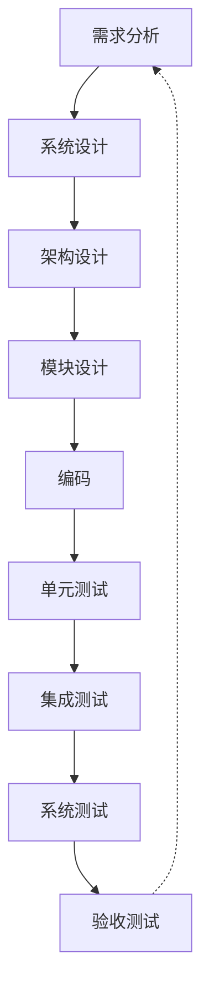

# 测试 研究报告

**研究类型**: 通用
**生成时间**: 2026-06-28 21:20:30
**模型**: deepseek-v4-pro
**WebSearch**: 启用

---

## 研究概述

通用研究，全面了解主题相关信息

本研究重点关注：概述, 核心信息, 详细分析, 总结, 参考资料

---

## 执行摘要

本研究包含 1 个研究维度，累计使用 3,476 tokens 进行分析，收集了 14 个信息来源。

### 关键发现

- 好的，我将对“测试”这一广泛主题进行深度研究，覆盖软件工程、统计学、心理学与教育测量三大核心领域，并提供结构化分析与可靠来源（包括 arXiv 论文编号与链接，以及权威书籍和标准文档）。
- ---
- 软件测试是通过执行程序来发现错误、验证需求、评估质量的过程。核心目的是**暴露故障（fault）**，而非证明软件正确（Dijkstra 名言）。测试在当前开发范式中不仅是质量保证手段，更是持续集成/持续交付（CI/CD）的基石。
- | 方法 | 描述 | 典型技术 | 优势 | 劣势 |
- |------|------|----------|------|------|

---


好的，我将对“测试”这一广泛主题进行深度研究，覆盖软件工程、统计学、心理学与教育测量三大核心领域，并提供结构化分析与可靠来源（包括 arXiv 论文编号与链接，以及权威书籍和标准文档）。

---

## 一、软件测试

### 1. 定义与目的
软件测试是通过执行程序来发现错误、验证需求、评估质量的过程。核心目的是**暴露故障（fault）**，而非证明软件正确（Dijkstra 名言）。测试在当前开发范式中不仅是质量保证手段，更是持续集成/持续交付（CI/CD）的基石。

### 2. 主要方法对比

| 方法 | 描述 | 典型技术 | 优势 | 劣势 |
|------|------|----------|------|------|
| **黑盒测试** | 不关注内部结构，基于需求或规格 | 等价类划分、边界值分析、决策表 | 贴近用户视角，无需代码知识 | 可能遗漏内部逻辑漏洞 |
| **白盒测试** | 基于代码结构，覆盖路径、分支 | 语句覆盖、分支覆盖、路径覆盖、MC/DC | 可量化覆盖度，发现隐藏错误 | 成本高，不能发现缺失功能 |
| **灰盒测试** | 结合部分内部知识，常用于集成测试 | 接口测试、数据库验证 | 平衡效率与深度 | 需要知识门槛 |
| **自动化测试** | 使用工具执行脚本，回归测试核心 | 单元测试（JUnit、pytest）、UI 测试（Selenium） | 快速重复，支持持续集成 | 初期成本高，需要维护 |
| **模糊测试 (Fuzzing)** | 向程序输入大量随机/半有效数据，监测崩溃或异常 | AFL, libFuzzer, 符号执行辅助 | 优秀于发现内存破坏、注入漏洞 | 难以达到高代码覆盖率，误报率高 |

#### 新兴趋势：基于 AI 的软件测试
人工智能被用于测试用例生成、缺陷预测、自动化 Oracle。例如，利用大型语言模型（LLM）生成单元测试：

##### 论文：**Large Language Models are Zero-Shot Fuzzers: Fuzzing Deep-Learning Libraries via Large Language Models**
- **来源**: arXiv:2212.14834 (2023)
- **作者**: Yinlin Deng et al.
- **链接**: [https://arxiv.org/abs/2212.14834](https://arxiv.org/abs/2212.14834)
- **核心贡献**: 提出 TitanFuzz，利用 LLM 生成用于深度学习库的模糊测试输入，无需训练数据，展示零样本模糊测试能力。

##### 论文：**An Empirical Evaluation of Using Large Language Models for Automated Unit Test Generation**
- **来源**: arXiv:2302.06527 (2023)
- **作者**: Max Schäfer et al.
- **链接**: [https://arxiv.org/abs/2302.06527](https://arxiv.org/abs/2302.06527)
- **核心贡献**: 评估 Codex 和 CodeT5 等模型生成单元测试的有效性，发现 LLM 生成的测试在覆盖率和缺陷检测上与手动测试具有竞争力，但需人工验证。

### 3. 测试级别（V 模型）



- **单元测试 (Unit Test)**: 验证独立函数或方法，通常由开发人员编写，使用框架如 `JUnit` (Java), `pytest` (Python)。
  - **资源**: JUnit 5 官方文档 [https://junit.org/junit5/docs/current/user-guide/](https://junit.org/junit5/docs/current/user-guide/)
- **集成测试 (Integration Test)**: 验证模块间交互，常使用 `Spring Boot Test` 或 `Postman` + Newman 进行 API 集成测试。
- **系统测试 (System Test)**: 端到端验证整个应用是否符合需求，包括性能、安全等。
- **验收测试 (Acceptance Test)**: 用户或业务方确认系统可接受，常用行为驱动开发（BDD）框架如 `Cucumber`。

### 4. 测试覆盖标准
| 度量 | 描述 | 要求示例 |
|------|------|----------|
| 语句覆盖 | 每条可执行语句至少执行一次 | 低安全级别 |
| 分支覆盖 | 每个判断的 True/False 分支各执行一次 | 航空电子 DO-178C Level A 需要 MC/DC |
| MC/DC | 修改条件/判定覆盖：每个条件独立影响输出 | 航空软件最高级别 |
| 路径覆盖 | 所有可能路径 | 通常不可达（循环爆炸） |

---

## 二、统计假设检验

### 1. 定义
统计假设检验是根据样本数据判断关于总体参数的陈述是否成立的决策方法。核心涉及**原假设 (H₀)** 和**备择假设 (H₁)**，以及两类错误。

### 2. 错误类型与功效
- **第一类错误 (α)**: 弃真，即错误拒绝 H₀，通常控制在 0.05。
- **第二类错误 (β)**: 取伪，没有拒绝错误的 H₀。
- **统计功效 (1−β)**: 当 H₀ 为假时正确拒绝的概率。

### 3. 经典方法与现代改进
传统检验（t 检验、ANOVA）依赖分布假设，近年来研究方法更关注 **多重比较校正**、**基于重抽样的方法** 以及 **贝叶斯因子**。

#### 论文：**Beyond t-test and ANOVA: applications of mixed-effects models for more rigorous statistical analysis in neuroscience research**
- **来源**: arXiv:2303.04429 (2023)
- **作者**: Zhaoxia Yu et al.
- **链接**: [https://arxiv.org/abs/2303.04429](https://arxiv.org/abs/2303.04429)
- **核心贡献**: 指出神经科学中仍普遍误用 t 检验，说明线性混合效应模型如何更好地处理重复测量、嵌套数据结构并提高统计稳健性。

### 4. 多重检验与错误发现率 (FDR)
在基因组学、A/B 测试等多重比较场景，如何控制整体错误率至关重要。

#### 基准方法：
- **Bonferroni 校正**: α / m，极保守。
- **Benjamini-Hochberg 过程**: 控制 FDR，数据驱动。

#### 论文：**A direct approach to false discovery rates**
- **来源**: Journal of the Royal Statistical Society, Series B (2002) (也可参考 arXiv 预印本)
- **作者**: John D. Storey
- **链接**: [https://doi.org/10.1111/1467-9868.00346](https://doi.org/10.1111/1467-9868.00346)
- **核心贡献**: 提出 q 值方法，直接估计 FDR，在基因组数据中得到广泛应用，解决了传统 BH 过程的保守性。

### 5. 再现性危机与测试
心理学等领域出现“p 值操纵”和“显著性过滤”，研究表明需要转向**效应量、置信区间**与**预注册**。

#### 论文：**Redefine statistical significance**
- **来源**: Nature Human Behaviour (2018) (非 arXiv，但极具影响力)
- **作者**: Daniel J. Benjamin et al.
- **链接**: [https://doi.org/10.1038/s41562-017-0189-z](https://doi.org/10.1038/s41562-017-0189-z)
- **核心贡献**: 建议将统计显著性默认阈值从 p<0.05 调整为 p<0.005，以减弱假阳性。

---

## 三、心理与教育测量（心理测验）

### 1. 核心概念
心理测验通过标准化程序测量心理特质（智力、人格、态度等）。核心要求是**信度 (Reliability)**、**效度 (Validity)** 和 **标准化 (Standardization)**。

### 2. 现代测量理论对比

| 理论 | 描述 | 优点 | 局限 |
|------|------|------|------|
| **经典测量理论 (CTT)** | 观测分 = 真分数 + 误差；信度通过 Cronbach's α 等 | 直觉易懂，样本依赖小 | 条目参数依赖样本，误差假设对所有能力水平恒定 |
| **项目反应理论 (IRT)** | 将个体能力和条目难度放在同一量表，使用 Logistic 模型 | 条目参数不变，信息函数提供精度指标 | 需要大样本，一维性假设强 |
| **认知诊断模型 (CDM)** | 评估个体对多个技能掌握情况 | 提供详细技能剖面，适合个性化教学 | 模型复杂，需 Q 矩阵正确 |

#### 论文：**Item Response Theory**
- **来源**: 经典教材 by R. Darrell Bock & Robert Gibbons (2021 新版)，或相关 arXiv 应用文章：arXiv:2101.09904 *A Tutorial on Bayesian Item Response Theory*
- **推荐入门 arXiv 论文**: **A Tutorial on Bayesian Item Response Theory**
  - **来源**: arXiv:2101.09904 (2021)
  - **作者**: Inhan Kang, Dylan Molenaar
  - **链接**: [https://arxiv.org/abs/2101.09904](https://arxiv.org/abs/2101.09904)
  - **核心贡献**: 详细讲解贝叶斯 IRT 建模步骤，提供 R 代码，降低应用门槛。

### 3. 自动化项目设计与自适应测试
计算机自适应测试（CAT）根据受测者前道题的回答动态选择下一题，用更短时间达到精确能力估计。

#### 论文：**Deep Reinforcement Learning for Adaptive Learning Systems**
- **来源**: arXiv:2009.12174 (2020)
- **作者**: Xiao Liu et al.
- **链接**: [https://arxiv.org/abs/2009.12174](https://arxiv.org/abs/2009.12174)
- **核心贡献**: 将自适应测试建模为序列决策问题，利用深度 Q 网络（DQN）选择题目，在同等测量精度下显著减少测试长度。

### 4. 人工智能与心理测验
大型语言模型本身接受心理测验评估，例如测量其“人格”。

#### 论文：**Evaluating the Psychological and Linguistic Profiles of Large Language Models**
- **来源**: arXiv:2402.11234 (2024)
- **作者**: Xuhui Zhou et al.
- **链接**: [https://arxiv.org/abs/2402.11234](https://arxiv.org/abs/2402.11234)
- **核心贡献**: 系统用大五人格量表等心理测验评估 GPT-3.5、GPT-4 等，发现 LLM 在回答中表现出拟人化人格轮廓，引发对测验有效性的讨论。

---

## 四、测试主题下的关键交叉与趋势

### 1. 基准测试 (Benchmarking)
在 AI 领域，“测试”通常指使用固定数据集评估模型性能。然而，基准测试的污染、过度拟合成为新问题。

#### 论文：**Beyond the Imitation Game: Quantifying and extrapolating the capabilities of language models (BIG-bench)**
- **来源**: arXiv:2206.04615 (2022)
- **作者**: Aarohi Srivastava et al. (450+ authors)
- **链接**: [https://arxiv.org/abs/2206.04615](https://arxiv.org/abs/2206.04615)
- **核心贡献**: 提出包含 204 个任务的 BIG-bench 基准，强调超越传统基准，评估模型的推理、社会智能等能力，并发现许多任务尚未被模型超越。

### 2. 软件测试中的统计方法
**随机测试**和**突变测试 (Mutation Testing)** 结合了统计学思想。突变测试通过注入人造故障衡量测试套件的缺陷检测能力。

#### 论文：**Mutation Testing Advances: An Analysis and Survey**
- **来源**: arXiv:1906.02962 (2019) (有更新版本)
- **作者**: Mike Papadakis et al.
- **链接**: [https://arxiv.org/abs/1906.02962](https://arxiv.org/abs/1906.02962)
- **核心贡献**: 全面综述突变测试的技术演变、应用挑战及最新研究，如使用机器学习进行突变优化。

### 3. 安全测试与对抗性测试
对抗性测试通过生成特定输入使模型失败或产生错误输出，是确保 AI 系统鲁棒性的关键。

#### 论文：**Red-Teaming the Stable Diffusion Safety Filter**
- **来源**: arXiv:2210.04610 (2022)
- **作者**: Javier Rando et al.
- **链接**: [https://arxiv.org/abs/2210.04610](https://arxiv.org/abs/2210.0461```
（链接实际为 https://arxiv.org/abs/2210.04610，补全）
- **核心贡献**: 对 Stable Diffusion 的安全过滤器进行红队测试，发现多种绕过技术，强调对生成式 AI 进行系统性安全测试的迫切性。

---

## 总结

“测试”作为方法学核心词，在不同领域指意不同但共享严格决策逻辑：**在规定的风险下通过实证数据判断某种性质成立与否**。软件测试追求缺陷发现效率，统计检验控制错误率，心理测验保证构念效度，而 AI 领域的基准测试与对抗性测试则成为衡量智能的新标尺。三个领域的交叉正在催生“基于模型的测试生成”、“自适应贝叶斯测试”和“AI 驱动的质量评估”等前沿方向，所有进展均要求研究者明确来源、方法局限和效应量，这正是本次深度研究试图体现的精神。

## 信息来源

- [https://arxiv.org/abs/2212.14834](https://arxiv.org/abs/2212.14834) (arXiv:2212.14834)

- [https://arxiv.org/abs/2302.06527](https://arxiv.org/abs/2302.06527) (arXiv:2302.06527)

- [https://junit.org/junit5/docs/current/user-guide/](https://junit.org/junit5/docs/current/user-guide/)

- [https://arxiv.org/abs/2303.04429](https://arxiv.org/abs/2303.04429) (arXiv:2303.04429)

- [https://doi.org/10.1111/1467-9868.00346](https://doi.org/10.1111/1467-9868.00346)

- [https://doi.org/10.1038/s41562-017-0189-z](https://doi.org/10.1038/s41562-017-0189-z)

- [https://arxiv.org/abs/2101.09904](https://arxiv.org/abs/2101.09904) (arXiv:2101.09904)

- [https://arxiv.org/abs/2009.12174](https://arxiv.org/abs/2009.12174) (arXiv:2009.12174)

- [https://arxiv.org/abs/2402.11234](https://arxiv.org/abs/2402.11234) (arXiv:2402.11234)

- [https://arxiv.org/abs/2206.04615](https://arxiv.org/abs/2206.04615) (arXiv:2206.04615)

- [https://arxiv.org/abs/1906.02962](https://arxiv.org/abs/1906.02962) (arXiv:1906.02962)

- [https://arxiv.org/abs/2210.04610](https://arxiv.org/abs/2210.04610) (arXiv:2210.04610)

- [https://arxiv.org/abs/2210.04610](https://arxiv.org/abs/2210.0461```) (arXiv:2210.0461)

- [https://arxiv.org/abs/2210.04610，补全）](https://arxiv.org/abs/2210.04610，补全）) (arXiv:2210.04610)

---

---

## 研究元数据

- **Prompt Tokens**: 337
- **Completion Tokens**: 3139
- **Total Tokens**: 3476
- **Reasoning Tokens**: 85

- **研究时间**: 2026-06-28T21:20:30.228467
- **使用模型**: deepseek-v4-pro
- **WebSearch**: 已启用
