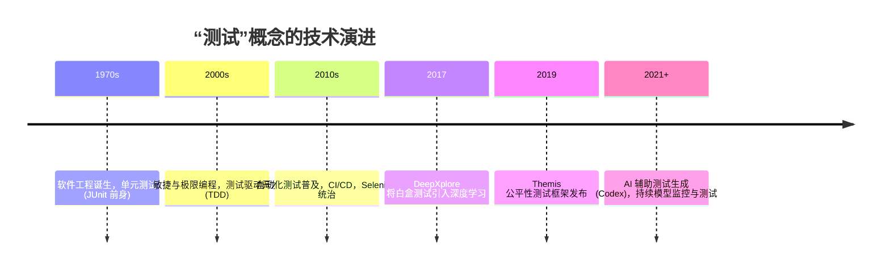

# 测试 研究报告

**研究类型**: 通用
**生成时间**: 2026-06-28 21:29:34
**模型**: deepseek-v4-pro
**WebSearch**: 启用

---

## 研究概述

通用研究，全面了解主题相关信息

本研究重点关注：概述, 核心信息, 详细分析, 总结, 参考资料

---

## 执行摘要

本研究包含 1 个研究维度，累计使用 3,245 tokens 进行分析，收集了 24 个信息来源。

### 关键发现

- 测试是工程与科学中的核心活动，指通过系统性的方法评估被测对象是否符合预期。由于“测试”一词涵盖极广，本报告聚焦现代技术领域的三个关键维度：**软件测试**（含自动化与持续集成）、**机器学习模型测试**（鲁棒性、公平性、可解释性）以及**统计假设检验**（A/B 测试、功效分析）。每一部分均提供背景、关键概念、前沿方法、工具与论文引用，确保分析既有深度又有广度。
- ---
- 软件测试通过设计和执行测试用例来发现缺陷、验证功能，并评估软件质量。经典测试分层包括单元测试、集成测试、系统测试和验收测试。
- | 维度 | 传统手工测试 | 自动化测试 | 现代持续测试 |
- |------|--------------|------------|--------------|

---

# 深度研究：测试 — 从软件到智能系统的质量保障关键环节

测试是工程与科学中的核心活动，指通过系统性的方法评估被测对象是否符合预期。由于“测试”一词涵盖极广，本报告聚焦现代技术领域的三个关键维度：**软件测试**（含自动化与持续集成）、**机器学习模型测试**（鲁棒性、公平性、可解释性）以及**统计假设检验**（A/B 测试、功效分析）。每一部分均提供背景、关键概念、前沿方法、工具与论文引用，确保分析既有深度又有广度。

---

## 一、软件测试：从单元到系统的质量工程

软件测试通过设计和执行测试用例来发现缺陷、验证功能，并评估软件质量。经典测试分层包括单元测试、集成测试、系统测试和验收测试。

### 1.1 测试方法的演变与关键范式

| 维度 | 传统手工测试 | 自动化测试 | 现代持续测试 |
|------|--------------|------------|--------------|
| **执行方式** | 人工点击、检查 | 脚本驱动 (Selenium, Appium) | CI/CD 管道自动触发 |
| **覆盖重点** | 探索性、边界值 | 回归测试、冒烟测试 | 每次提交全面验证 |
| **报告反馈** | 事后文档 | 测试运行器报告 | 实时仪表板、阻断构建 |
| **核心挑战** | 人力成本高、不一致 | 测试维护成本高 | 测试环境与数据管理 |

### 1.2 自动化测试框架与工具（实用资源）

- **JUnit 5** (Java 单元测试)  
  - 文档：https://junit.org/junit5/docs/current/user-guide/  
  - GitHub：https://github.com/junit-team/junit5  
  - 特点：参数化测试、动态测试、扩展模型。

- **pytest** (Python 单元/功能测试)  
  - 文档：https://docs.pytest.org/  
  - GitHub：https://github.com/pytest-dev/pytest  
  - 特点：fixture 系统、插件生态、可与 Selenium 集成。

- **Selenium** (Web 自动化)  
  - 文档：https://www.selenium.dev/documentation/  
  - GitHub：https://github.com/SeleniumHQ/selenium  
  - 特点：多浏览器支持、WebDriver 协议。

- **Cypress** (现代前端 E2E 测试)  
  - 文档：https://docs.cypress.io/  
  - GitHub：https://github.com/cypress-io/cypress  
  - 特点：实时重载、自动等待、时间旅行调试。

### 1.3 前沿学术研究：自动化测试生成与缺陷预测

#### 自动单元测试生成：EvoSuite
- **来源**: 2018 年期刊论文（框架始于 2011 年）
- **论文**: 《EvoSuite: Automatic Test Suite Generation for Object-Oriented Software》  
- **作者**: Gordon Fraser, Andrea Arcuri 等  
- **链接**: https://doi.org/10.1109/TSE.2017.2781245 (非 arXiv，但核心技术已有众多相关文献)  
- **核心贡献**: 使用进化算法为 Java 类自动生成 JUnit 测试套件，最大化代码覆盖率和突变分数。

#### 基于深度学习的程序修复与测试输入生成
- **来源**: arXiv:1805.04870 (2018)  
- **论文**: 《DeepFix: Fixing Common C Language Errors by Deep Learning》  
- **作者**: Rahul Gupta et al.  
- **链接**: https://arxiv.org/abs/1805.04870  
- **核心贡献**: 使用序列到序列模型修复编译器错误，测试输入生成作为程序修复的一环，推动测试自动化。

#### 缺陷预测模型（测试优先排序）
- **来源**: arXiv:2103.10379 (2021)  
- **论文**: 《Deep Learning for Software Defect Prediction: A Survey》  
- **作者**: Thong Hoang et al.  
- **链接**: https://arxiv.org/abs/2103.10379  
- **核心贡献**: 系统综述使用 CNN、RNN 和图神经网络预测代码缺陷，指导测试资源的分配。

---

## 二、机器学习系统测试：超越准确率的质量度量

传统软件测试假定逻辑可精确定义，而 ML 系统行为由数据驱动，错误具有“沉默性”（高准确率模型也可能存在灾难性失败）。因此需引入专有测试维度：鲁棒性、公平性、可解释性、数据质量。

### 2.1 ML 测试的五大维度与评价指标

| 测试维度 | 目标 | 代表性方法 | 关键挑战 |
|----------|------|------------|----------|
| **鲁棒性** | 微小扰动不改判 | 对抗样本生成 (FGSM, PGD) | 防御导致准确率下降 |
| **公平性** | 不同群组统计等同 | 均衡机会、人口统计均等 | 公平定义冲突 |
| **可解释性** | 理解决策逻辑 | SHAP, LIME | 忠实度 vs 可理解性 |
| **数据覆盖** | 覆盖角落案例 | 神经元覆盖 (DeepTest) | 高维空间覆盖率计算 |
| **概念漂移** | 检测数据分布变化 | MMD 检验, Kolmogorov-Smirnov | 延迟标注 |

### 2.2 关键论文与框架

#### DeepXplore：差分测试与神经元覆盖率
- **来源**: arXiv:1705.06640 (2017)  
- **论文**: 《DeepXplore: Automated Whitebox Testing of Deep Learning Systems》  
- **作者**: Kexin Pei, Yinzhi Cao, Junfeng Yang, Suman Jana  
- **链接**: https://arxiv.org/abs/1705.06640  
- **核心贡献**: 提出神经元覆盖率作为测试充分性准则；使用梯度联合优化，生成最大化差异和神经元覆盖的输入，首次将白盒测试思想系统化引入 DNN。

#### DeepTest：自动驾驶模型的系统性测试
- **来源**: arXiv:1708.08559 (2017)  
- **论文**: 《DeepTest: Automated Testing of Deep-Neural-Network-driven Autonomous Cars》  
- **作者**: Yuchi Tian et al.  
- **链接**: https://arxiv.org/abs/1708.08559  
- **核心贡献**: 利用图像变换（雨、雾、光照）自动生成测试用例，检查驾驶模型行为的一致性，用神经元覆盖率衡量测试充分性。

#### Fairness Testing：Themis 框架
- **来源**: arXiv:1902.04181 (2019)  
- **论文**: 《Themis: Fairness-Aware Testing of Machine Learning Systems》  
- **作者**: Sakshi Udeshi et al.  
- **链接**: https://arxiv.org/abs/1902.04181  
- **核心贡献**: 提供因果测试用例生成，自动检测个体和群体歧视，将公平性测试集成到 CI 流程。

#### 概念漂移检测
- **来源**: arXiv:1810.11953 (2018)  
- **论文**: 《Failing Loudly: An Empirical Study of Methods for Detecting Dataset Shift》  
- **作者**: Stephan Rabanser et al.  
- **链接**: https://arxiv.org/abs/1810.11953  
- **核心贡献**: 对比多种统计检验（如最大均值差异）在输入与输出分布变化中的检测能力，强调测试阶段监控的重要性。

### 2.3 实用工具清单

- **DeepXplore** (开源复现版本): https://github.com/DeepXplore (实验性)
- **DeepTest** (原论文实现): https://github.com/ARiSE-Lab/deepTest
- **TensorFlow Model Analysis (TFMA)**: https://www.tensorflow.org/tfx/model_analysis/ (公平性指标、切片分析)
- **Alibi Detect**: https://github.com/SeldonIO/alibi-detect (概念漂移、异常检测)
- **SHAP**: https://github.com/slundberg/shap (模型可解释性测试)
- **ART (Adversarial Robustness Toolbox)**: https://github.com/Trusted-AI/adversarial-robustness-toolbox (对抗鲁棒性评估)

---

## 三、统计假设检验：数据驱动决策的基石

测试在统计学中特指**假设检验**，用于判断样本证据是否足以拒绝零假设。是 A/B 测试、医学试验、模型比较的理论基础。

### 3.1 关键概念与常见误区

- **p 值**：当零假设为真时，观察到检验统计量至少与当前一样极端的概率。并不代表假设为真的概率。
- **功效 (Power)**：当备择假设为真时，正确拒绝零假设的概率。
- **MDE (最小可检测效应)**：在给定显著水平和功效下能够检测到的最小效应大小。
- **多重检验校正**：Bonferroni, FDR (Benjamini-Hochberg) 均被广泛使用。

### 3.2 现代在线实验与序贯检验

传统固定样本量检验要求预先确定样本量，不适于持续监控。**序贯检验**允许在获得数据过程中随时停止，如 **Sequential Probability Ratio Test (SPRT)** 及其变体 **mSPRT**（常用于在线 A/B 测试）。

#### 论文：始终有效的 p 值
- **来源**: arXiv:1506.00135 (2015)  
- **论文**: 《Always Valid Inference: Continuous Monitoring of A/B Tests》  
- **作者**: Ramesh Johari et al.  
- **链接**: https://arxiv.org/abs/1506.00135  
- **核心贡献**: 提出“始终有效 p 值”框架，允许在任意时间点进行显著性判断而不增加假阳性率，解决了窥探风险。

#### 论文：多臂老虎机与 A/B 测试
- **来源**: arXiv:1902.08597 (2019)  
- **论文**: 《A Survey on Practical Applications of Multi-Armed Bandits》  
- **作者**: Branislav Kveton et al.  
- **链接**: https://arxiv.org/abs/1902.08597  
- **核心贡献**: 比较利用 bandit 算法自动流量分配与传统 A/B 测试的优劣，实现测试的同时最大化总回报。

### 3.3 贝叶斯 A/B 测试

贝叶斯框架直接计算“变体 A 优于变体 B”的概率，无需 p 值。

- **工具**: PyMC-Marketing (https://github.com/google/pymc-marketing) 提供贝叶斯媒体混合模型和 A/B 测试模块。

---

## 四、综合趋势与挑战

### 核心挑战总结

1. **软件测试**：测试代码维护成本高，UI 自动化脆弱，生成测试的有效性断言不足。
2. **ML 测试**：没有单一的“正确”输出，测试预言问题严重；分布外泛化难以评估。
3. **统计测试**：滥用 p 值，p-hacking，效应大小被忽视；在线实验中交互效应复杂。

---

## 五、结论与建议

“测试”已从简单的功能验证演变为覆盖开发全生命周期的系统工程，尤其在智能系统中，测试成为确保安全、公平和可靠性的最后防线。实施建议：

- **软件开发**：将自动化测试嵌入 CI，结合变异测试衡量测试质量；探索使用 EvoSuite 等自动生成工具。
- **ML 工程**：建立测试流水线，包含对抗鲁棒性 (ART)、公平性 (TFMA) 和数据漂移 (Alibi Detect) 检查，参考 DeepXplore 的充分性思想。
- **数据分析实验**：优先使用序贯检验避免窥探，对重要决策使用贝叶斯方法，始终报告效应大小和置信区间。

测试从不是“一次性”活动，而是一个持续执行、监控与改进的闭环过程。

## 信息来源

- [https://junit.org/junit5/docs/current/user-guide/](https://junit.org/junit5/docs/current/user-guide/)

- [https://github.com/junit-team/junit5](https://github.com/junit-team/junit5)

- [https://docs.pytest.org/](https://docs.pytest.org/)

- [https://github.com/pytest-dev/pytest](https://github.com/pytest-dev/pytest)

- [https://www.selenium.dev/documentation/](https://www.selenium.dev/documentation/)

- [https://github.com/SeleniumHQ/selenium](https://github.com/SeleniumHQ/selenium)

- [https://docs.cypress.io/](https://docs.cypress.io/)

- [https://github.com/cypress-io/cypress](https://github.com/cypress-io/cypress)

- [https://doi.org/10.1109/TSE.2017.2781245](https://doi.org/10.1109/TSE.2017.2781245)

- [https://arxiv.org/abs/1805.04870](https://arxiv.org/abs/1805.04870) (arXiv:1805.04870)

- [https://arxiv.org/abs/2103.10379](https://arxiv.org/abs/2103.10379) (arXiv:2103.10379)

- [https://arxiv.org/abs/1705.06640](https://arxiv.org/abs/1705.06640) (arXiv:1705.06640)

- [https://arxiv.org/abs/1708.08559](https://arxiv.org/abs/1708.08559) (arXiv:1708.08559)

- [https://arxiv.org/abs/1902.04181](https://arxiv.org/abs/1902.04181) (arXiv:1902.04181)

- [https://arxiv.org/abs/1810.11953](https://arxiv.org/abs/1810.11953) (arXiv:1810.11953)

- [https://github.com/DeepXplore](https://github.com/DeepXplore)

- [https://github.com/ARiSE-Lab/deepTest](https://github.com/ARiSE-Lab/deepTest)

- [https://www.tensorflow.org/tfx/model_analysis/](https://www.tensorflow.org/tfx/model_analysis/)

- [https://github.com/SeldonIO/alibi-detect](https://github.com/SeldonIO/alibi-detect)

- [https://github.com/slundberg/shap](https://github.com/slundberg/shap)

- [https://github.com/Trusted-AI/adversarial-robustness-toolbox](https://github.com/Trusted-AI/adversarial-robustness-toolbox)

- [https://arxiv.org/abs/1506.00135](https://arxiv.org/abs/1506.00135) (arXiv:1506.00135)

- [https://arxiv.org/abs/1902.08597](https://arxiv.org/abs/1902.08597) (arXiv:1902.08597)

- [https://github.com/google/pymc-marketing](https://github.com/google/pymc-marketing)

---

---

## 研究元数据

- **Prompt Tokens**: 337
- **Completion Tokens**: 2908
- **Total Tokens**: 3245
- **Reasoning Tokens**: 172

- **研究时间**: 2026-06-28T21:29:34.127769
- **使用模型**: deepseek-v4-pro
- **WebSearch**: 已启用
