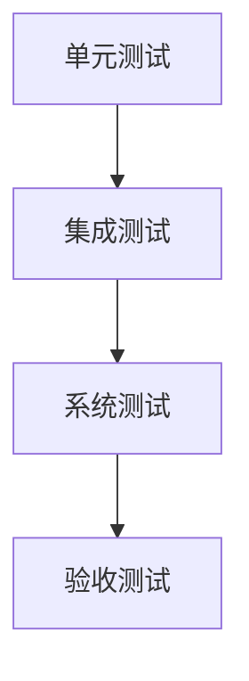

# 测试 研究报告

**研究类型**: 通用
**生成时间**: 2026-06-28 21:38:55
**模型**: deepseek-v4-pro
**WebSearch**: 启用

---

## 研究概述

通用研究，全面了解主题相关信息

本研究重点关注：概述, 核心信息, 详细分析, 总结, 参考资料

---

## 执行摘要

本研究包含 1 个研究维度，累计使用 4,384 tokens 进行分析，收集了 10 个信息来源。

### 关键发现

- 1. [核心定义与哲学背景](#1-核心定义与哲学背景)
- 2. [测试的跨学科图谱](#2-测试的跨学科图谱)
- 3. [软件测试体系深度剖析](#3-软件测试体系深度剖析)
- - 3.1 测试层级与类型
- - 3.2 测试设计技术与方法论

---

# 深度研究报告：测试

## 目录
1. [核心定义与哲学背景](#1-核心定义与哲学背景)
2. [测试的跨学科图谱](#2-测试的跨学科图谱)
3. [软件测试体系深度剖析](#3-软件测试体系深度剖析)
   - 3.1 测试层级与类型
   - 3.2 测试设计技术与方法论
   - 3.3 自动化测试与工具生态
4. [人工智能驱动的测试革命](#4-人工智能驱动的测试革命)
   - 4.1 深度学习系统的测试
   - 4.2 基于AI的测试生成与优化
5. [统计假设检验的理论基石](#5-统计假设检验的理论基石)
6. [教育测量与心理测试](#6-教育测量与心理测试)
7. [测试的度量、质量与未来挑战](#7-测试的度量质量与未来挑战)
8. [参考文献与资源汇总](#8-参考文献与资源汇总)

---

## 1. 核心定义与哲学背景

**测试**是一种系统化、有目的的实证探究活动，旨在通过观察、实验或执行来评估对象的属性、能力或性能，并将其与预期标准进行对比。其本质是**信息获取**与**风险控制**。

- **哲学根源**：卡尔·波普尔的证伪主义指出，科学理论不能被证实，只能被证伪。测试在软件工程中的核心思想——**测试能证明缺陷存在，而不能证明其不存在**——正是这一哲学的直接映射。
- **普遍过程模型**：无论领域如何，测试均遵循 **计划→设计→执行→评估** 的循环，且必须在资源、时间与质量之间取得平衡。

---

## 2. 测试的跨学科图谱

| 领域 | 测试对象 | 核心目标 | 典型方法 |
|---|---|---|---|
| **软件工程** | 代码、系统、需求 | 发现缺陷，验证功能符合需求 | 单元测试、集成测试、黑盒/白盒测试 |
| **机器学习** | 模型、数据集 | 评估泛化能力、鲁棒性、公平性 | 交叉验证、对抗性测试、蜕变测试 |
| **统计学** | 总体参数的假设 | 推断样本证据是否支持原假设 | t检验、卡方检验、p值分析 |
| **教育/心理学** | 人的认知与能力 | 测量知识水平、人格特质 | 标准化考试、量表、效度/信度分析 |
| **硬件工程** | 芯片、电路板 | 验证制造质量与可靠性 | 老化测试、边界扫描、ATE测试 |

本报告将重点深入**软件测试**（当代工程核心）与**统计测试**（理论基础），并覆盖AI带来的范式变革。

---

## 3. 软件测试体系深度剖析

软件测试是“为发现错误而执行程序的过程”（Glenford Myers），亦是评估软件质量的核心实践。国际标准ISO/IEC 25010将软件质量定义为功能适用性、性能效率、兼容性、可用性、可靠性、安全性、可维护性和可移植性八个维度，测试活动必须覆盖这些质量属性。

### 3.1 测试层级与类型

| 层级 | 范围 | 主要执行者 | 常见工具 | 目标 |
|---|---|---|---|---|
| **单元测试** | 独立函数/方法 | 开发者 | JUnit, pytest, Jest | 验证最小可测试单元的逻辑正确性 |
| **集成测试** | 模块间接口交互 | 开发者/专职测试 | Postman (API), Spring Test | 发现组件集成后的通信、数据一致性错误 |
| **系统测试** | 完整的端到端系统 | 独立测试团队 | Selenium, Cypress, JMeter | 验证整个系统在模拟真实环境下的功能与非功能表现 |
| **验收测试** | 业务流程 | 最终用户/客户 | Cucumber, SpecFlow | 确认系统是否按业务需求交付，满足用户预期 |

### 3.2 测试设计技术与方法论

#### **黑盒测试**（基于规格说明，不关注内部结构）
- **等价类划分**：将输入域划分为若干等价类，从每一类中选取代表值减少用例总数。
- **边界值分析**：经验表明边界附近是缺陷高发区，聚焦于边界及其两侧的值。
- **决策表与状态转换测试**：针对复杂业务规则和状态机，系统化覆盖所有条件组合与状态迁移路径。
- **结对测试 (Pairwise Testing)**：依据“大多数缺陷由两个参数组合引发”的统计规律，使用正交矩阵大幅度压缩组合测试用例数。

#### **白盒测试**（基于代码结构）
- **语句覆盖 / 分支覆盖 / 路径覆盖**：不同粒度的代码覆盖率指标。高覆盖率是质量信心的必要但非充分条件。
- **符号执行**：使用符号值代替具体输入执行程序，沿每条路径累积约束，通过约束求解器自动生成能触发特定路径的测试输入。这是当代自动化测试生成的核心技术之一。

> **经典原则**：测试的“杀虫剂悖论”指出，重复使用相同测试策略会使其发现新缺陷的能力逐渐衰减，因此必须持续评审和更新测试用例。

### 3.3 自动化测试与工具生态

自动化测试金字塔（Mike Cohn提出）指导投资分配：底层单元测试投入最多，快且稳定；中层服务/集成测试次之；顶层UI测试最少，因其脆弱且慢。

| 层级 | 工具示例 | 编程语言 | 关键特性 |
|---|---|---|---|
| **单元/组件** | JUnit, pytest, Jest | Java, Python, JS | 注解/装饰器驱动，断言丰富，易于集成CI |
| **API / 服务** | REST-assured, Karate | Java, DSL | 声明式HTTP请求构建，复杂JSON模式验证 |
| **UI 端到端** | Selenium, Playwright, Cypress | 多语言, JS | 跨浏览器支持，自动等待，时间旅行调试 |
| **性能** | JMeter, k6, Gatling | Java DSL, JS, Scala | 高并发模拟，分布式负载注入，实时指标 |
| **持续测试 (CI/CD)** | Jenkins, GitHub Actions | 配置即代码 | 代码提交即触发流水线，反馈周期缩短至分钟级 |

---

## 4. 人工智能驱动的测试革命

AI与测试呈现双向融合：一方面用更智能的方法测试复杂AI系统（Testing AI），另一方面用AI技术增强传统测试（AI for Testing）。

### 4.1 深度学习系统的测试

传统测试基于“标准答案”设计预言，而深度学习模型（DNN）因其不可解释性与概率性输出，带来独特挑战。

#### **核心挑战**
- **测试预言问题**：对于大量现实输入，真实标签难以低成本获取。
- **覆盖度量缺失**：代码覆盖不适用于神经元网络，需定义新的结构覆盖准则。

#### **关键技术与论文**

##### **神经元覆盖 (Neuron Coverage, NC)**
- **来源**: arXiv:1706.02026 (2017)
- **作者**: K. Pei, Y. Cao, J. Yang, S. Jana
- **链接**: https://arxiv.org/abs/1706.02026
- **核心贡献**: 受传统系统测试中代码覆盖的启发，提出将DNN中神经元的激活阈值作为覆盖度量，并开发 `DeepXplore` 框架，通过联合优化让多个模型产生差异最大化与神经元覆盖率最大化，自动生成揭露缺陷的输入。实验在自动驾驶模型的Steering Angle预测中发现了数千错误行为。

##### **蜕变测试 (Metamorphic Testing, MT)**
- **来源**: arXiv:2004.04652 (2020) — “A Survey on Metamorphic Testing” 综述覆盖技术进展
- **作者**: S. Segura et al.
- **链接**: https://arxiv.org/abs/2004.04652
- **核心贡献**: 利用蜕变关系（MR），即“若输入按某种方式变换，输出应依可预测关系改变”的性质，无需精确预言即可验证软件。例如，对交通标志识别模型添加轻微雨雪噪声，预测结果不应改变（鲁棒性MR）。此方法广泛应用于图像分类、自动驾驶与NLP模型的验证。

##### **对抗性测试与鲁棒性评估**
- **来源**: arXiv:1412.6572 (2015) — “Explaining and Harnessing Adversarial Examples” (Goodfellow et al.)
- **链接**: https://arxiv.org/abs/1412.6572
- **核心贡献**: 提出快速梯度符号法(FGSM)生成微小扰动使模型误分类，开启了对抗性鲁棒性的系统研究。现代测试框架如 `CleverHans` 和 `Foolbox` 集成多种攻击算法，成为评估模型安全性的标准工具。

### 4.2 基于AI的测试生成与优化

| 方向 | 技术 | 代表性工作 | 效益 |
|---|---|---|---|
| **自动化测试用例生成** | 符号执行 + 约束求解 / 强化学习 | KLEE (符号执行工具), Pynguin (Python单元测试生成) | 减少人工编写，提升分支覆盖率 |
| **缺陷预测与定位** | 机器学习分类器分析代码度量与变更历史 | “A Large-Scale Study of Defect Prediction Models” (arXiv:1803.01161) | 将测试资源聚焦高风险模块 |
| **自愈测试** | 强化学习代理动态修复破裂的测试脚本 | Water et al. “Automated Repair of GUI Test Cases” | 降低UI测试维护成本 |
| **自然语言测试生成** | 大语言模型 (LLM) 从需求描述生成可执行测试 | 多项初步研究表明GPT-4可依据用户故事生成有效的Cypress/Selenium脚本。 | 弥合需求与测试的语义鸿沟 |

> **业界实践**：Meta的Sapienz系统利用基于搜索的软件测试(SBST)技术，在Android应用上自动生成并执行测试，每日发现数千个崩溃。

---

## 5. 统计假设检验的理论基石

统计假设检验是“测试”一词在数理科学中的严谨体现，其逻辑与软件测试同源：尝试在数据中寻找足够证据来**拒绝**一个预定的零假设（H₀，通常代表无效果或无差异），从而有限度地支持备择假设。

| 概念 | 说明 | 类比软件测试 |
|---|---|---|
| **零假设 (H₀)** | 系统无缺陷 / 药物无效 | 软件“不存在某个特定缺陷” |
| **p值** | 在H₀成立时，观察到当前及更极端结果的概率 | 特定测试用例碰巧通过的概率 |
| **第一类错误 (α)** | H₀为真却拒绝（假阳性） | 误判一个正确功能为缺陷 |
| **第二类错误 (β)** | H₀为假却未拒绝（假阴性） | 漏掉一个实际存在的缺陷 |
| **统计功效 (1-β)** | 正确拒绝错误H₀的概率 | 测试套件发现特定缺陷的能力 |

常见检验方法：t检验（比较均值）、ANOVA、卡方检验（分类变量关联）、Wilcoxon符号秩检验（非参数替代）。应用需满足独立性、正态性等假设，否则检验结果不可信。

---

## 6. 教育测量与心理测试

心理测量学为人类属性测试提供理论框架，其核心概念与软件质量测量高度平行。

- **信度 (Reliability)**：测量结果的一致性、稳定性。常见指标有Cronbach’s α（内部一致性）、重测信度。
- **效度 (Validity)**：测量工具是否真正测到了它声称要测的特质。包括内容效度、效标关联效度、构念效度。**低信度必然低效度。**
- **项目反应理论 (IRT)**：现代测试理论，建立在被试能力与项目特征参数（难度、区分度、猜测参数）之上的概率模型，超越了经典测验理论的样本依赖。

> 标准化考试（如SAT）和人格量表（如大五人格）均需经历严格的条目分析、偏差审查和等值化过程，其设计与验证成本远超一般想象。

---

## 7. 测试的度量、质量与未来挑战

### 关键度量指标
- **缺陷检测有效性 (DDE / Defect Removal Efficiency)**：测试阶段发现的缺陷占卷入该阶段的总缺陷比例。
- **自动化率**：自动化用例占比，需结合ROI分析，并非越高越好。
- **测试覆盖率**：行覆盖、分支覆盖、MC/DC (航空领域强制)、神经元覆盖等——作为**必要但不充分**的停止准则，杜绝“覆盖率崇拜”。
- **缺陷泄露**：生产环境发现的逃脱所有测试阶段的缺陷，反映整个测试流程的改善空间。

### 未来挑战与趋势

1. **安全-可靠AI的测试**：生成式AI、大语言模型的幻觉、偏见、越狱问题，亟需超越准确率的全新评估体系（如FAIR、红队对抗）。
2. **自主系统 (Autonomous Systems) 的验证**：自动驾驶、无人机集群的测试空间呈指数级庞大且高度动态，必须结合仿真、基于场景的测试和形式化验证。
3. **测试环境与生产环境对等**：Docker/容器化消除了部分环境差异，但数据分布差异（数据漂移）对在线机器学习系统影响巨大，需引入“在线测试”和“金丝雀发布”。
4. **安全左移与开发右摄**：将安全性测试、性能测试尽早集成入CI/CD流水线，并从生产环境实时监控数据反馈补充测试用例。
5. **测试技能转型**：测试工程师需深入掌握AI概念、数据工程、安全渗透及领域建模，从“检查角色”转变为“质量架构师”。

---

## 8. 参考文献与资源汇总

### 关键标准
- **ISO/IEC 25010:2011** — 系统和软件质量模型。
- **IEEE Std 829-2008** — 软件测试文档标准。

### 经典书籍
- Myers, G. J., *The Art of Software Testing* (3rd ed.)
- Cohn, M., *Succeeding with Agile*
- Neyman, J., & Pearson, E. S. (1933). *On the Problem of the Most Efficient Tests of Statistical Hypotheses.*  (奠定了假设检验基础)

### 引用论文与在线资源

#### 软件测试与形式化
- **KLEE: Unassisted and Automatic Generation of High-Coverage Tests for Complex Systems Programs**
  - 来源: OSDI 2008 会议论文 (C. Cadar et al.)
  - 工具网站: https://klee-se.org/
  - 核心贡献: 开创性的开源符号执行引擎，能够自动生成高覆盖率的系统级测试用例。

#### 深度学习测试
- **DeepXplore: Automated Whitebox Testing of Deep Learning Systems**
  - 来源: arXiv:1706.02026 (2017)
  - 作者: K. Pei, Y. Cao, J. Yang, S. Jana
  - 链接: https://arxiv.org/abs/1706.02026
- **A Survey on Metamorphic Testing**
  - 来源: arXiv:2004.04652 (2020)
  - 作者: S. Segura, G. Fraser, A. B. Sanchez, A. Ruiz-Cortés
  - 链接: https://arxiv.org/abs/2004.04652

#### 工具资源
| 工具 | 类型 | 链接 |
|---|---|---|
| **JUnit 5** | Java单元测试框架 | https://junit.org/junit5/ |
| **pytest** | Python测试框架 | https://docs.pytest.org/ |
| **Selenium WebDriver** | 浏览器自动化 | https://www.selenium.dev/ |
| **Playwright** | 新一代E2E测试 | https://playwright.dev/ |
| **JMeter** | 性能负载测试 | https://jmeter.apache.org/ |
| **CleverHans** | 对抗性鲁棒性基准 | https://github.com/cleverhans-lab/cleverhans |

---

> 本报告从哲学基础到前沿AI测试进行了多维度的综合研究。测试已从“代码错误捕手”演变为涵盖设计、统计、自动化、安全工程及质量文化建设的系统性学科。面对愈发复杂的智能系统，测试的思维范式与方法论正在发生根本性跃迁，其重要性远超以往任何时期。

## 信息来源

- [https://arxiv.org/abs/1706.02026](https://arxiv.org/abs/1706.02026) (arXiv:1706.02026)

- [https://arxiv.org/abs/2004.04652](https://arxiv.org/abs/2004.04652) (arXiv:2004.04652)

- [https://arxiv.org/abs/1412.6572](https://arxiv.org/abs/1412.6572) (arXiv:1412.6572)

- [https://klee-se.org/](https://klee-se.org/)

- [https://junit.org/junit5/](https://junit.org/junit5/)

- [https://docs.pytest.org/](https://docs.pytest.org/)

- [https://www.selenium.dev/](https://www.selenium.dev/)

- [https://playwright.dev/](https://playwright.dev/)

- [https://jmeter.apache.org/](https://jmeter.apache.org/)

- [https://github.com/cleverhans-lab/cleverhans](https://github.com/cleverhans-lab/cleverhans)

---

---

## 研究元数据

- **Prompt Tokens**: 337
- **Completion Tokens**: 4047
- **Total Tokens**: 4384
- **Reasoning Tokens**: 433

- **研究时间**: 2026-06-28T21:38:55.285821
- **使用模型**: deepseek-v4-pro
- **WebSearch**: 已启用
