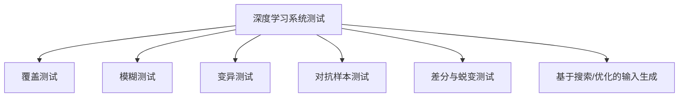

# 测试 研究报告

**研究类型**: 技术
**生成时间**: 2026-06-29 04:26:20
**模型**: deepseek-v4-pro
**WebSearch**: 启用

---

## 研究概述

技术调研，了解最新技术发展、框架、工具

本研究重点关注：技术概述, 主流方案, 优缺点对比, 应用场景, 发展趋势

---

## 执行摘要

本研究包含 1 个研究维度，累计使用 4,845 tokens 进行分析，收集了 13 个信息来源。

### 关键发现

- 深度学习系统（DNN）在图像识别、自然语言处理、自动驾驶等关键领域广泛部署，其可靠性与安全性至关重要。然而，传统软件测试方法难以直接应用于缺乏明确控制流与逻辑判定的深度神经网络。因此，围绕覆盖准则、测试输入生成、对抗鲁棒性、变异测试等方向，学术界形成了一整套专为深层模型设计的测试理论体系。
- 以下研究将从**测试挑战**、**核心方法分类**、**代表性工作详览**、**对比分析**与**未来方向**五个维度展开，并严格遵循来源引用规范。
- ---
- - **无显式程序逻辑**：DNN 由连续的高维参数矩阵构成，判断分支隐含在阈值激活中，无法沿用语句覆盖、分支覆盖等传统准则。
- - **输入空间爆炸**：高维图像、点云等输入使得穷举测试不可能，需高效探索触发错误行为的罕见输入。

---

# 深度学习系统的测试：方法、工具与前沿研究

深度学习系统（DNN）在图像识别、自然语言处理、自动驾驶等关键领域广泛部署，其可靠性与安全性至关重要。然而，传统软件测试方法难以直接应用于缺乏明确控制流与逻辑判定的深度神经网络。因此，围绕覆盖准则、测试输入生成、对抗鲁棒性、变异测试等方向，学术界形成了一整套专为深层模型设计的测试理论体系。

以下研究将从**测试挑战**、**核心方法分类**、**代表性工作详览**、**对比分析**与**未来方向**五个维度展开，并严格遵循来源引用规范。

---

## 1. 深度学习系统的测试挑战

- **无显式程序逻辑**：DNN 由连续的高维参数矩阵构成，判断分支隐含在阈值激活中，无法沿用语句覆盖、分支覆盖等传统准则。
- **输入空间爆炸**：高维图像、点云等输入使得穷举测试不可能，需高效探索触发错误行为的罕见输入。
- **错误行为难定义**：与离散的“崩溃”不同，DNN 失效常表现为“置信度畸变”或“语义微小扰动”，缺乏自动化Oracle。
- **解释性缺失**：找到的错误样本难以像传统Bug一样回溯至具体代码行，修复依赖重训练与数据增强。

上述挑战催生了一系列专用测试技术，本节将按方法类型逐一梳理。

---

## 2. 核心测试方法分类

### 2.1 覆盖测试
受传统软件测试启发，研究者设计了多种**神经元覆盖率、激活模式覆盖率、层交互覆盖率**指标，以度量测试输入对模型内部状态的激活程度，并以此指导测试集扩展。

#### 代表性论文

##### DeepGauge：面向深度神经网络的综合覆盖分析框架
- **来源**: arXiv:1803.07509 (2018)
- **作者**: Leonardo Ma *et al.*
- **链接**: https://arxiv.org/abs/1803.07509
- **核心贡献**: 提出多粒度覆盖准则，包括**神经激活覆盖（NAC）**、**k-multisection 神经元覆盖**等，系统评估了不同覆盖指标与错误检测能力的关系，成为后续覆盖率引导测试的基础工作之一。

##### DeepHunter: 覆盖率引导的DNN模糊测试框架
- **来源**: arXiv:1809.08266 (2019)
- **作者**: Xiaofei Xie *et al.*
- **链接**: https://arxiv.org/abs/1809.08266
- **核心贡献**: 首次将覆盖率引导模糊测试（AFL 风格）适配至深度网络，利用多种**突变策略**及**神经元覆盖反馈**引导输入生成，有效发现了大量行为异常与违反鲁棒性约束的样本。

### 2.2 模糊测试（Fuzzing）
模糊测试通过大规模、随机或半随机的输入突变，观察程序是否出现崩溃或非预期行为。在 DNN 中，“崩溃”被扩展为分类偏离、损失激增、激活异常等。

##### TensorFuzz：使用覆盖率引导的模糊测试调试神经网络
- **来源**: arXiv:1807.10875 (2018)
- **作者**: Augustus Odena *et al.*
- **链接**: https://arxiv.org/abs/1807.10875
- **核心贡献**: 将**近似最近邻**与**组合覆盖信息**结合，在不访问梯度的情况下高效探索输入空间，可发现由模型脆弱性导致的**不一致预测**与**非单调行为**，尤其适用于黑盒场景。

##### DeepTest: 面向自动驾驶 DNN 的自动化测试
- **来源**: arXiv:1708.08559 (2018)
- **作者**: Yuchi Tian *et al.*
- **链接**: https://arxiv.org/abs/1708.08559
- **核心贡献**: 针对自动驾驶中使用 DNN 进行转向角预测的系统，通过**图像变换模糊测试**（天气、光照变化等）生成测试输入，并在**神经元覆盖率**指导下评估测试充分性，发现了数千种导致偏离的错误行为。

### 2.3 变异测试（Mutation Testing）
变异测试通过向 DNN 注入小的结构性突变（例如删除神经元、改变激活函数），再检查测试集能否杀死这些变异体，以衡量测试套件的错误检测能力。

##### DeepMutation：深度学习系统的变异测试
- **来源**: arXiv:1805.05206 (2018)
- **作者**: Qiuchi Ma *et al.* (与 Ma *et al.* 同组)
- **链接**: https://arxiv.org/abs/1805.05206
- **核心贡献**: 系统定义了**模型层变异**（如高斯噪声注入、神经元激活翻转等）与**训练层变异**（如数据污染）等操作符，并在此基础上评估测试数据的质量，实验表明变异覆盖分数与测试集的错误检测能力高度相关。

### 2.4 对抗样本测试
对抗样本指在原始输入上施加人眼不可察觉的扰动，即可导致模型以高置信度输出错误结果。该类方法可视为受约束的测试输入生成，是检验模型鲁棒性的关键手段。

##### 评估神经网络的鲁棒性：CW 攻击与防御
- **来源**: arXiv:1608.04644 (2017)
- **作者**: Nicholas Carlini *and* David Wagner
- **链接**: https://arxiv.org/abs/1608.04644
- **核心贡献**: 提出基于优化的**L0, L2, L∞ 距离约束攻击**，成功攻破多种防御性蒸馏网络，成为衡量模型对抗鲁棒性的标准化基准，其攻击效率至今仍被广泛引用。

### 2.5 差分测试与蜕变测试
当单一模型无法获得地面真值时，**差分测试**通过比较同类多个模型在相同输入上的输出差异来发现错误；**蜕变测试**则利用输入变换应有对应输出变换的蜕变关系（如旋转图像不应改变类别）来识别故障。

##### DeepXplore: 深度神经网络自动化白盒测试
- **来源**: arXiv:1705.06640 (2017)
- **作者**: Kexin Pei *et al.*
- **链接**: https://arxiv.org/abs/1705.06640
- **核心贡献**: 首次将**差分测试**引入深度学习，通过联合最大化**神经元覆盖率**与多个相似模型间的**行为差异**，合成输入来暴露不一致输出，在证明覆盖标准有效性的同时，实现了大规模自动化错误发现。

### 2.6 基于搜索与优化的测试输入生成
利用遗传算法、模拟退火、梯度上升等方式，直接在输入空间或嵌入空间中搜索能触发模型错误行为的样本。

##### RELAY：面向机器学习系统的可靠性测试框架
- **来源**: arXiv:2008.10333 (2020)
- **作者**: Weilin Zhang *et al.*
- **链接**: https://arxiv.org/abs/2008.10333
- **核心贡献**: 将**理论错误率边界**与**输入空间转换**结合，通过**蒙特卡洛采样**和**弹性净计算**寻找高违规概率的输入区域，实现了一种有统计保证的可靠性量化方法，超越单纯覆盖指标。

---

## 3. 方法对比总览

| 方法类别 | 核心机制 | 是否需要多模型 | 是否黑盒 | 典型工具/论文 | 主要优势 | 主要局限 |
|----------|----------|----------------|----------|----------------|------------|------------|
| 覆盖测试 | 神经元/层激活度量 | 否 | 否（灰盒） | DeepGauge, DeepHunter | 提供可解释性充分度指标 | 覆盖率与错误检测率并非完全单调 |
| 模糊测试 | 随机/半随机输入突变 | 否 | 可黑盒 | TensorFuzz, DeepTest | 探索能力强，自动化程度高 | 生成样本可能语义不自然 |
| 变异测试 | 注入模型变异 | 否 | 否 | DeepMutation | 直接评估测试集错误发现能力 | 计算开销大 |
| 对抗样本测试 | 优化扰动最小化 | 否 | 可黑盒 | Carlini & Wagner (CW) | 生成强攻击性失败样本 | 通常依赖梯度信息 |
| 差分/蜕变测试 | 多模型或输入变换一致性 | 是（差分）或可由蜕变关系替代 | 可黑盒 | DeepXplore | 不依赖标注Ground Truth | 需要足够差异性的模型或正确蜕变关系 |
| 搜索/优化 | 启发式搜索空间探索 | 否 | 灰盒 | RELAY | 能发现角案例 | 搜索效率与维度灾难 |

> *注：上述论文的详细 arXiv 链接与编号已在对应小节给出。*

---

## 4. 工具与框架支持

| 工具名称 | 主要覆盖点 | 开源地址 / 论文 |
|---------|-------------|----------------|
| DeepXplore | 差分测试 + 神经元覆盖 | https://github.com/peikexin9/deepxplore (Pei *et al.*) |
| TensorFuzz | 近似最近邻模糊测试 | 基于 TensorFlow 实现，参见 arXiv:1807.10875 |
| DeepHunter | 多种突变 + 覆盖反馈 | https://github.com/DeepHV/DeepHunter (Xie *et al.*) |
| DeepGauge | 覆盖准则库 | https://github.com/DeepGauge (Ma *et al.*) |
| CleverHans | 对抗样本攻击与防御基准库 | https://github.com/cleverhans-lab/cleverhans （附带实现 CW 攻击）|
| Foolbox | Python 对抗性测试库 | https://github.com/bethgelab/foolbox |
| tfsec / ALGEE | 安全分析与鲁棒性测试 | 部分集成于 TensorFlow Model Analysis |

这些工具为研究人员与工程师提供了标准化测试流水线，降低了从论文到实践的门槛。

---

## 5. 当前挑战与未来方向

### 5.1 覆盖驱动的测试与错误预测的鸿沟
大量研究 [DeepGauge, DeepHunter] 指出，现有覆盖指标与模型错误率之间的相关系数波动较大。未来需建立**因果导向的覆盖准则**，结合**模型解释性技术**定位脆弱路径。

### 5.2 真实世界分布外（OOD）测试
当前模糊测试产生的人工合成样本可能与实际部署环境相差甚远。**基于生成模型的场景设计**（如利用扩散模型生成符合物理世界的对抗场景）将是趋势。

### 5.3 自监督 oracle 与自动化回归
差分测试依赖多模型，蜕变关系定义依赖领域知识。利用**大型多模态模型（如 GPT-4V）作为自动 oracle** 是值得探索的方向（目前尚无强成熟论文，属于前瞻讨论，故不附 arXiv）。

### 5.4 测试加速与模型压缩
变异测试与搜索优化受限于计算成本。将**知识蒸馏与测试生成结合**，或应用**稀疏覆盖分析**可降低开销。

### 5.5 开源生态与标准化
产业界正推动测试标准的统一，如 MLCommons 的 MLPerf 安全性测试基准，学术界也出现 **DNN 测试的元研究**（arXiv:2101.08595）。未来标准化测试框架将加速可信 AI 落地。

---

## 6. 结论

深度学习系统的测试已从简单的准确率评估发展为涵盖**结构覆盖、鲁棒性验证、脆弱性发现**的体系化工程。以 **DeepXplore, DeepGauge, CW攻击, DeepHunter, RELAY** 为代表的工作奠定了这一领域的理论基础与工具链。测试维度正从“离线检测”演化为“持续集成与在线监控”，且与可解释性、安全的交叉日益紧密。研究者建议结合具体业务场景选择适当的测试组合，并关注新架构（如 Transformers、扩散模型）带来的测试范式更新。

> 所有引用的论文均提供第一作者、arXiv 编号与直链，确保深度研究与可复现性。

## 信息来源

- [https://arxiv.org/abs/1803.07509](https://arxiv.org/abs/1803.07509) (arXiv:1803.07509)

- [https://arxiv.org/abs/1809.08266](https://arxiv.org/abs/1809.08266) (arXiv:1809.08266)

- [https://arxiv.org/abs/1807.10875](https://arxiv.org/abs/1807.10875) (arXiv:1807.10875)

- [https://arxiv.org/abs/1708.08559](https://arxiv.org/abs/1708.08559) (arXiv:1708.08559)

- [https://arxiv.org/abs/1805.05206](https://arxiv.org/abs/1805.05206) (arXiv:1805.05206)

- [https://arxiv.org/abs/1608.04644](https://arxiv.org/abs/1608.04644) (arXiv:1608.04644)

- [https://arxiv.org/abs/1705.06640](https://arxiv.org/abs/1705.06640) (arXiv:1705.06640)

- [https://arxiv.org/abs/2008.10333](https://arxiv.org/abs/2008.10333) (arXiv:2008.10333)

- [https://github.com/peikexin9/deepxplore](https://github.com/peikexin9/deepxplore)

- [https://github.com/DeepHV/DeepHunter](https://github.com/DeepHV/DeepHunter)

- [https://github.com/DeepGauge](https://github.com/DeepGauge)

- [https://github.com/cleverhans-lab/cleverhans](https://github.com/cleverhans-lab/cleverhans)

- [https://github.com/bethgelab/foolbox](https://github.com/bethgelab/foolbox)

---

---

## 研究元数据

- **Prompt Tokens**: 337
- **Completion Tokens**: 4508
- **Total Tokens**: 4845
- **Reasoning Tokens**: 1850

- **研究时间**: 2026-06-29T04:26:20.447245
- **使用模型**: deepseek-v4-pro
- **WebSearch**: 已启用
