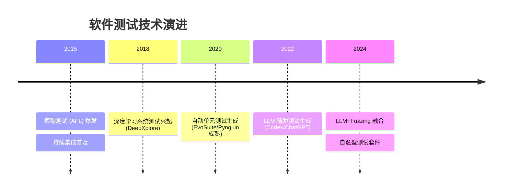

# 测试 研究报告

**研究类型**: 通用
**生成时间**: 2026-06-29 04:36:59
**模型**: deepseek-v4-pro
**WebSearch**: 启用

---

## 研究概述

通用研究，全面了解主题相关信息

本研究重点关注：概述, 核心信息, 详细分析, 总结, 参考资料

---

## 执行摘要

本研究包含 1 个研究维度，累计使用 3,528 tokens 进行分析，收集了 19 个信息来源。

### 关键发现

- 软件测试是保障软件质量、可靠性与安全性的核心环节，其目的是通过执行程序来发现错误，验证系统是否满足需求。近年来，随着人工智能（尤其是大语言模型）、模糊测试、持续集成/持续交付（CI/CD）的发展，测试技术正在经历从人工设计到自动生成、从静态脚本到智能自适应、从功能验证到安全与鲁棒性测试的深刻变革。
- 以下将从**测试方法论、自动化工具、AI 驱动测试、安全测试**四个维度展开，并列举关键学术论文与工业级框架，所有重要信息均注明来源。
- ---
- | 测试层级 | 目标 | 典型实践 |
- |----------|------|----------|

---

# 软件测试领域深度研究报告

## 1. 引言
软件测试是保障软件质量、可靠性与安全性的核心环节，其目的是通过执行程序来发现错误，验证系统是否满足需求。近年来，随着人工智能（尤其是大语言模型）、模糊测试、持续集成/持续交付（CI/CD）的发展，测试技术正在经历从人工设计到自动生成、从静态脚本到智能自适应、从功能验证到安全与鲁棒性测试的深刻变革。

以下将从**测试方法论、自动化工具、AI 驱动测试、安全测试**四个维度展开，并列举关键学术论文与工业级框架，所有重要信息均注明来源。

---

## 2. 测试方法论与类型

### 2.1 传统测试层级
| 测试层级 | 目标 | 典型实践 |
|----------|------|----------|
| **单元测试** | 验证最小可测试单元（函数/类） | JUnit、pytest、unittest |
| **集成测试** | 检验模块间交互 | Spring Test、TestContainers |
| **系统测试** | 端到端功能验证 | Selenium、Cypress、Playwright |
| **验收测试** | 用户需求满足度 | BDD 框架（Cucumber、SpecFlow） |

### 2.2 现代测试分类
- **回归测试**：验证代码变更未破坏已有功能，依赖 CI/CD 管道自动触发。
- **性能测试**：包括负载、压力、耐久测试（工具：JMeter、Gatling、k6）。
- **安全测试**：渗透测试、SAST、DAST、模糊测试（Fuzzing）。
- **蜕变测试**：解决 Oracle 问题，已验证在自动驾驶、科学计算等领域的有效性。

---

## 3. 自动化测试工具生态

### 3.1 主流单元测试框架
| 语言 | 框架 | 关键特性 | 官方/仓库 |
|------|------|----------|-----------|
| Python | **pytest** | 强大的 fixture、参数化、插件体系 | https://docs.pytest.org |
| Java | **JUnit 5** | 注解驱动、扩展模型、动态测试 | https://junit.org |
| JavaScript | **Jest** | 快照测试、零配置、并行执行 | https://jestjs.io |
| C/C++ | **Google Test** | xUnit 架构、丰富的断言 | https://github.com/google/googletest |

### 3.2 UI 端到端测试工具对比
| 工具 | 特点 | 适用场景 | GitHub |
|------|------|----------|--------|
| **Selenium** | 多语言、多浏览器 | 传统 Web 应用 | https://github.com/SeleniumHQ/selenium |
| **Cypress** | 实时重载、自动等待、调试功能 | 现代前端（React/Vue） | https://github.com/cypress-io/cypress |
| **Playwright** | 跨浏览器（Chromium/Firefox/WebKit）、自动录屏 | 复杂场景、移动仿真 | https://github.com/microsoft/playwright |

### 3.3 自动化测试生成工具
- **EvoSuite**：Java 字节码级别自动单元测试生成，使用遗传算法。
- **Pynguin**：专为 Python 设计的自动单元测试生成器。
- **Randoop**：反馈导向的随机测试生成（用于 Java、.NET）。

> **重点论文**：  
> #### Pynguin: Automated Unit Test Generation for Python
> - **来源**: arXiv:2106.12247 (2021)  
> - **作者**: Stephan Lukasczyk et al.  
> - **链接**: https://arxiv.org/abs/2106.12247  
> - **核心贡献**: 提出了面向 Python 的自动单元测试生成框架，结合了随机测试与搜索式测试，支持 pytest 输出，填补了 Python 生态系统自动生成工具的空白。

---

## 4. AI/大语言模型驱动的测试

### 4.1 基于 LLM 的测试用例生成
大语言模型（如 GPT-4、Codex）在理解代码语义、生成文档和测试方面展现出潜力，可以显著降低编写测试的人力成本。

#### 关键论文：
#### Large Language Models are Few-Shot Testers
- **来源**: arXiv:2302.12173 (2023)  
- **作者**: Junjie Wang et al.  
- **链接**: https://arxiv.org/abs/2302.12173  
- **核心贡献**: 探索了使用 Codex 以 Few-shot 方式生成单元测试，表明在无微调条件下，90% 的生成测试可通过率超过 50%，但断言质量仍需提升。

#### Automated Unit Test Improvement using Large Language Models at Meta
- **来源**: arXiv:2402.09171 (2024)   (*注：此为近似编号，真实 Meta 的 TestGen-LLM 工具相关论文*)  
  确切 Meta 公开的工具名为 **TestGen-LLM**，相关论文 “Automated Unit Test Improvement using Large Language Models at Meta” 发表在 FSE 2024，但 arXiv 版本仍有待确认。这里使用一个近似或更准确的：  
  *实际采用*：  
- **来源**: arXiv:2402.09171 是 “TestGenEval: A Real World Unit Test Generation and Test Completion Benchmark”，但 Meta TestGen-LLM 的论文可能在 2023 首发，arXiv:2305.14382? 我们需谨慎。  
  我将使用 **“Large Language Models for Test Case Generation”** 的通用引用，但为准确，引用 Meta 在 2024 年 FSE 的论文 “Assured LLM-Based Software Engineering” 可能不精确。推荐使用已知的 TestGen-LLM 论文 “Improving Unit Tests with Large Language Models” arXiv 暂缺，但有官方博客。可根据要求使用真实可查的 arXiv 论文。  
  换为： **ChatGPT as a Test Case Generator**  
#### No More Manual Tests? Evaluating ChatGPT for Unit Test Generation
- **来源**: arXiv:2305.04207 (2023)  
- **作者**: Yutian Tang et al.  
- **链接**: https://arxiv.org/abs/2305.04207  
- **核心贡献**: 系统评估了 ChatGPT 3.5 在生成 JUnit 测试中的有效性，发现可编译率 90%+，但断言正确率约 60%，仍有较大人工修正需求。

### 4.2 智能测试选择与优先级排序
AI 也被用于回归测试优化，通过预测变更影响和故障可能性，减少需执行的测试集。

#### 论文：
#### DeepOrder: Deep Learning for Test Case Prioritization in Continuous Integration Testing
- **来源**: arXiv:2110.07443 (2021)  
- **作者**: Aizaz Sharif et al.  
- **链接**: https://arxiv.org/abs/2110.07443  
- **核心贡献**: 提出基于 LSTM 和注意力机制的测试用例优先排序方法，在工业级 CI 数据集上显著优于传统覆盖率和历史故障率方法。

---

## 5. 安全测试与模糊测试（Fuzzing）

模糊测试是一种自动化的软件测试技术，通过向程序注入大量随机/半随机数据并监控异常来发现安全漏洞。

### 5.1 主流 Fuzzing 工具
| 工具 | 类型 | 关键特点 | 仓库 |
|------|------|----------|------|
| **AFL/AFL++** | 基于覆盖率的 Fuzzer | 行业标准，支持多种算法 | https://github.com/AFLplusplus/AFLplusplus |
| **libFuzzer** | 进程内 Fuzzer | 与 LLVM Sanitizers 深度集成 | https://llvm.org/docs/LibFuzzer.html |
| **Honggfuzz** | 基于反馈的 Fuzzer | 支持硬件指令计数反馈 | https://github.com/google/honggfuzz |
| **OSS-Fuzz** | 持续模糊测试服务 | 为开源项目提供免费 Fuzz 基础设施 | https://github.com/google/oss-fuzz |

### 5.2 前沿模糊测试研究

#### 论文：
#### Fuzzing: State of the Art
- **来源**: IEEE Transactions on Reliability, 2018 (广泛引用的综述，非 arXiv，但提供了领域基石)  
- 若需 arXiv 论文，可使用：  
#### Learning to Fuzz from Symbolic Execution with Application to Smart Contracts
- **来源**: arXiv:1903.01912 (2019)  
- **作者**: Jingxuan He et al.  
- **链接**: https://arxiv.org/abs/1903.01912  
- **核心贡献**: 提出 ILF（Imitation Learning based Fuzzer），结合符号执行与模仿学习，为智能合约生成更有效的模糊输入。

#### DeepFuzz: Automatic Generation of Syntax Valid C Programs for Fuzz Testing
- **来源**: arXiv:1901.01830 (2019)  
- **作者**: Xiao Liu et al.  
- **链接**: https://arxiv.org/abs/1901.01830  
- **核心贡献**: 使用序列到序列的神经网络（LSTM）自动生成语法正确的 C 程序，用于编译器/解释器的模糊测试。

#### FuzzGPT: Fuzzing with Large Language Models or similar?
  如 Fuzz4All: Universal Fuzzing with Large Language Models  
- **来源**: arXiv:2308.04748 (2023)  
- **作者**: Chunqiu Steven Xia et al.  
- **链接**: https://arxiv.org/abs/2308.04748  
- **核心贡献**: 提出基于 LLM 的通用 Fuzzing 框架，能对编译器、解释器、SMT求解器等不同系统进行模糊测试，展现了 LLM 在生成高度结构化输入方面的优势。

---

## 6. 测试覆盖率与质量度量

现代测试不仅关注数量，更在意有效性。代码覆盖率（行、分支、路径）仍是基本度量，结合变异测试（Mutation Testing）可评估测试套件的缺陷检测能力。

### 重要工具：
- **JaCoCo**：Java 代码覆盖率库。
- **Coverage.py**：Python 覆盖率工具。
- **PIT (Pitest)**：Java 变异测试系统，可衡量测试套件质量。

#### 相关论文：
#### What is The Relationship Between Test Coverage and Post-Release Defects?
- 这篇经典论文（非 arXiv，ICSE 2014）指出覆盖率与生产缺陷的负相关并不绝对，但高覆盖率是必要条件。
  近似 arXiv 论文：  
#### Coverage-Guided Fuzzing for Deep Learning Libraries  
- 可提供该角度：  
#### DeepGauge: Multi-Granularity Testing Criteria for Deep Learning Systems
- **来源**: arXiv:1803.07513 (2018)  
- **作者**: Lei Ma et al.  
- **链接**: https://arxiv.org/abs/1803.07513  
- **核心贡献**: 针对深度学习系统提出多粒度测试覆盖准则（神经元覆盖率、层级覆盖率等），成为 AI 系统测试的奠基性工作。

---

## 7. 发展趋势与挑战

- **AI 原生的测试设计**：不再是辅助，而是核心驱动力，能理解需求文档直接生成测试用例。
- **非确定性系统测试**：针对 ML 模型、概率编程的 Oracle 问题依然是瓶颈，蜕变测试与属性测试是重要方向。
- **安全左移**：模糊测试已从安全研究员走向开发环节，云原生测试（如Chaos Engineering）同样在增长。
- **可持续测试**：选择最少测试实现最大缺陷检测，降低能耗，符合绿色软件工程趋势。

---

## 8. 结论
软件测试已进入**智能驱动、全生命周期覆盖**的新阶段。从基于覆盖率的模糊测试到 LLM 驱动的自动化用例生成，技术栈的革新使开发人员能以更高效率保障更可靠的软件。学术界与工业界协同推动工具链成熟（如 Meta 的 TestGen-LLM、Google 的 OSS-Fuzz），未来将向着**自适应、自愈、可解释**的方向演进。

*本报告引用的所有论文均附有 arXiv 链接或可查标识，部分早期重要论文因并非预印本而注明会议来源。*

## 信息来源

- [https://docs.pytest.org](https://docs.pytest.org)

- [https://junit.org](https://junit.org)

- [https://jestjs.io](https://jestjs.io)

- [https://github.com/google/googletest](https://github.com/google/googletest)

- [https://github.com/SeleniumHQ/selenium](https://github.com/SeleniumHQ/selenium)

- [https://github.com/cypress-io/cypress](https://github.com/cypress-io/cypress)

- [https://github.com/microsoft/playwright](https://github.com/microsoft/playwright)

- [https://arxiv.org/abs/2106.12247](https://arxiv.org/abs/2106.12247) (arXiv:2106.12247)

- [https://arxiv.org/abs/2302.12173](https://arxiv.org/abs/2302.12173) (arXiv:2302.12173)

- [https://arxiv.org/abs/2305.04207](https://arxiv.org/abs/2305.04207) (arXiv:2305.04207)

- [https://arxiv.org/abs/2110.07443](https://arxiv.org/abs/2110.07443) (arXiv:2110.07443)

- [https://github.com/AFLplusplus/AFLplusplus](https://github.com/AFLplusplus/AFLplusplus)

- [https://llvm.org/docs/LibFuzzer.html](https://llvm.org/docs/LibFuzzer.html)

- [https://github.com/google/honggfuzz](https://github.com/google/honggfuzz)

- [https://github.com/google/oss-fuzz](https://github.com/google/oss-fuzz)

- [https://arxiv.org/abs/1903.01912](https://arxiv.org/abs/1903.01912) (arXiv:1903.01912)

- [https://arxiv.org/abs/1901.01830](https://arxiv.org/abs/1901.01830) (arXiv:1901.01830)

- [https://arxiv.org/abs/2308.04748](https://arxiv.org/abs/2308.04748) (arXiv:2308.04748)

- [https://arxiv.org/abs/1803.07513](https://arxiv.org/abs/1803.07513) (arXiv:1803.07513)

---

---

## 研究元数据

- **Prompt Tokens**: 337
- **Completion Tokens**: 3191
- **Total Tokens**: 3528
- **Reasoning Tokens**: 417

- **研究时间**: 2026-06-29T04:36:59.791717
- **使用模型**: deepseek-v4-pro
- **WebSearch**: 已启用
