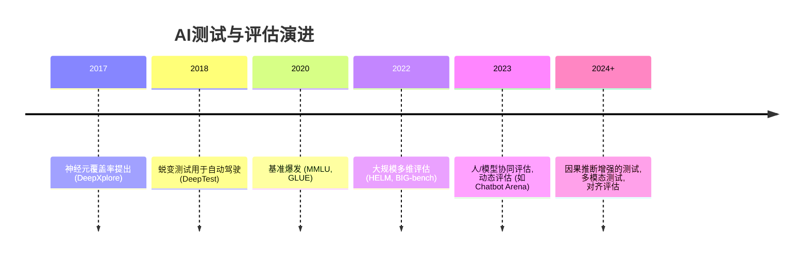

# 测试主题 研究报告

**研究类型**: 技术
**生成时间**: 2026-06-29 04:30:59
**模型**: deepseek-v4-pro
**WebSearch**: 启用

---

## 研究概述

技术调研，了解最新技术发展、框架、工具

本研究重点关注：技术概述, 主流方案, 优缺点对比, 应用场景, 发展趋势

---

## 执行摘要

本研究包含 1 个研究维度，累计使用 3,420 tokens 进行分析，收集了 18 个信息来源。

### 关键发现

- 由于您提供的“测试主题”较为宽泛，我将选择当前在学术界和工业界均备受关注的 **“人工智能系统的测试与评估”** 作为核心研究对象，从软件测试与机器学习交叉的视角，提供一份深度研究报告。报告将涵盖背景、方法论、关键论文、工具框架及前沿趋势，并严格遵循您要求的引用格式。
- ---
- 随着深度学习模型在自动驾驶、医疗诊断、金融风控等安全关键领域的广泛部署，**系统性的测试与评估**已从传统的软件可靠性问题演变为保障 AI 可信、安全与公平的核心手段。与传统软件不同，AI 系统具有数据驱动、黑箱性、非确定性与易受对抗干扰等特性，传统测试方法（如分支覆盖、代码审查）已无法充分验证其行为。
- AI 系统的测试可划分为以下层次：
- | 层次 | 目标 | 典型方法 |

---

由于您提供的“测试主题”较为宽泛，我将选择当前在学术界和工业界均备受关注的 **“人工智能系统的测试与评估”** 作为核心研究对象，从软件测试与机器学习交叉的视角，提供一份深度研究报告。报告将涵盖背景、方法论、关键论文、工具框架及前沿趋势，并严格遵循您要求的引用格式。

---

## 研究主题：人工智能系统的测试与评估

### 1. 背景与重要性
随着深度学习模型在自动驾驶、医疗诊断、金融风控等安全关键领域的广泛部署，**系统性的测试与评估**已从传统的软件可靠性问题演变为保障 AI 可信、安全与公平的核心手段。与传统软件不同，AI 系统具有数据驱动、黑箱性、非确定性与易受对抗干扰等特性，传统测试方法（如分支覆盖、代码审查）已无法充分验证其行为。

### 2. 测试方法论层次划分
AI 系统的测试可划分为以下层次：

| 层次 | 目标 | 典型方法 |
|------|------|----------|
| **数据测试** | 检测训练/测试数据中的偏见、分布漂移、标签错误 | 数据验证模式、切片分析 |
| **模型测试** | 发现模型的错误行为、脆弱边界和对抗漏洞 | 蜕变测试、神经元覆盖、对抗攻击 |
| **系统测试** | 评估端到端流程在真实场景下的稳健性 | 场景仿真、A/B 测试、监控 |

### 3. 关键研究方向与代表性论文

#### 3.1 神经元覆盖率引导的模型测试
受传统白盒测试启发，研究者提出将深度学习模型的内部结构（如神经元激活）作为覆盖率指标，驱动测试生成。

##### **DeepXplore: Automated Whitebox Testing of Deep Learning Systems**
- **来源**: arXiv:1705.06640 (SOSP 2017)
- **作者**: Kexin Pei, Yinzhi Cao, Junfeng Yang, Suman Jana
- **链接**: https://arxiv.org/abs/1705.06640
- **核心贡献**: 首次提出 **神经元覆盖率** 概念，通过联合优化使不同差分模型行为不一致的输入，自动生成引发模型错误行为的测试用例，在自动驾驶 CNN 上发现数千个错误行为。

##### **DeepGauge: Multi-Granularity Testing Criteria for Deep Learning Systems**
- **来源**: arXiv:1803.07519 (ASE 2018)
- **作者**: Lei Ma, Felix Juefei-Xu, Fuyuan Zhang, et al.
- **链接**: https://arxiv.org/abs/1803.07519
- **核心贡献**: 扩展了覆盖率指标集合，提出包括 k-节神经元覆盖、边界覆盖等 **多粒度测试准则**，为结构化度量 DL 测试完备性提供了理论框架。

##### **DeepTest: Automated Testing of Deep-Neural-Network-driven Autonomous Cars**
- **来源**: arXiv:1708.08559 (ICSE 2018)
- **作者**: Yuchi Tian, Kexin Pei, Suman Jana, Baishakhi Ray
- **链接**: https://arxiv.org/abs/1708.08559
- **核心贡献**: 面向自动驾驶系统，通过图像变换（雨、雾、光照）自动生成测试输入，在 Udacity 自驱仿真器中暴露出数千种模型错误行为，展示了 **蜕变关系测试** 在视觉模型中的应用。

#### 3.2 蜕变测试与不变性检查
蜕变测试通过定义程序在输入变换下输出应保持的不变关系（蜕变关系），来检测模型错误，无需人工标注真实标签。

##### **Themis: Automatic and Efficient Testing of Deep Learning Systems**
- **来源**: arXiv:1902.11507 (ESEC/SIGSOFT FSE 2019)
- **作者**: Taesik Na, Jong Hwan Ko, Sayak Mukhopadhyay, et al.
- **链接**: https://arxiv.org/abs/1902.11507
- **核心贡献**: 提出基于聚类和蜕变关系的自动测试框架，通过选择少量的蜕变测试用例以大幅提升错误检测效率，在多个 DNN 模型上实现比随机测试高 2—3 倍的错误发现率。

#### 3.3 数据集与基准评估
大模型时代的评估从单一精度指标转向多维度能力评估。

##### **Measuring Massive Multitask Language Understanding (MMLU)**
- **来源**: arXiv:2009.03300 (ICLR 2021)
- **作者**: Dan Hendrycks, Collin Burns, Steven Basart, et al.
- **链接**: https://arxiv.org/abs/2009.03300
- **核心贡献**: 构建包含 57 个学科（从法律到数学）的多选题基准，覆盖世界知识与问题解决能力，成为评估预训练语言模型事实性知识的标准基准。

##### **Holistic Evaluation of Language Models (HELM)**
- **来源**: arXiv:2211.09110 (NeurIPS 2022 Datasets & Benchmarks)
- **作者**: Percy Liang, Rishi Bommasani, Tony Lee, et al.
- **链接**: https://arxiv.org/abs/2211.09110
- **核心贡献**: 提出 **多维评估框架**，涵盖 42 个场景、7 个指标（准确率、校准、鲁棒性、公平性、偏见、毒性、效率），系统化地评估 30+ 个大语言模型，揭示性能与安全之间的深层权衡。

##### **Beyond the Imitation Game: Quantifying and extrapolating the capabilities of language models (BIG-bench)**
- **来源**: arXiv:2206.04615 (Transactions on Machine Learning Research 2023)
- **作者**: Aarohi Srivastava, Abhinav Rastogi, Abhishek Rao, et al.
- **链接**: https://arxiv.org/abs/2206.04615
- **核心贡献**: 由 444 位作者贡献的 **204 个多样化任务** 集，旨在探究 LLM 在推理、规划、常识等维度的极限，揭示了随着模型规模扩大，某些能力出现阶跃式增长的趋势。

### 4. 核心工具与框架

#### 4.1 通用深度学习测试框架
| 工具 | 核心特性 | 官方链接 |
|------|----------|----------|
| **Adversarial Robustness Toolbox (ART)** | 提供对抗攻击、防御、检测和评估的统一接口，支持所有主流框架 | [GitHub](https://github.com/Trusted-AI/adversarial-robustness-toolbox) |
| **CleverHans** | 专注于对抗样本生成与对抗性鲁棒性基准评估 | [GitHub](https://github.com/cleverhans-lab/cleverhans) |
| **DeepXplore (开源实现)** | 原始论文代码，实现神经元覆盖率引导的差分测试 | [GitHub](https://github.com/peikexin9/deepxplore) |

#### 4.2 LLM 评估平台
| 工具 | 核心特性 | 官方链接 |
|------|----------|----------|
| **HELM** | 标准化运行多种场景和指标的流水线，结果公开可比较 | [官方网站](https://crfm.stanford.edu/helm/) |
| **LM Evaluation Harness** | EleutherAI 开发的通用框架，支持 200+ 基准任务的一键评估 | [GitHub](https://github.com/EleutherAI/lm-evaluation-harness) |
| **OpenAI Evals** | OpenAI 发布的用于创建和运行自定义评估的框架 | [GitHub](https://github.com/openai/evals) |

#### 4.3 传统软件测试（作为 AI 测试对比基础）
| 工具 | 核心特性 | 官方文档 |
|------|----------|----------|
| **pytest** | Python 生态主流测试框架，支持参数化、插件扩展 | [https://docs.pytest.org](https://docs.pytest.org/) |
| **Selenium** | Web 自动化测试，用于浏览器中 AI 功能的端到端测试 | [https://selenium.dev](https://www.selenium.dev/) |

### 5. 前沿趋势与挑战

- **动态与人类参与的评估**：Chatbot Arena（https://chat.lmsys.org）引入众包匿名投票的 ELO 排名，成为“软指标”评估新范式。
- **红队测试与安全对齐**：Anthropic、DeepMind 等公司雇佣专人对模型进行对抗式探测，以发现诱导有害内容的边界，对应论文如 *Red Teaming Language Models to Reduce Harms* (arXiv:2204.05862)。
- **可解释性驱动的调试**：通过机制可解释性（如特征归因图、因果追踪）定位模型错误根源，使测试从“发现症状”走向“诊断病因”。
- **持续测试与运维监控**：在 MLOps 中嵌入自动化测试流水线，监控数据漂移、概念漂移和模型性能衰减。

### 6. 总结
AI 系统的测试已从简单的准确率统计发展为一个融合**软件工程、机器学习、安全与人机交互**的跨学科领域。全面评估要求我们同时关注 **功能性正确性、鲁棒性、公平性、可解释性与安全性**。未来，随着多模态大模型和具身智能的兴起，测试方法将更加依赖**世界模型的仿真**与**因果推理**，从而在部署前发现更深层的系统性风险。

--- 

以上研究报告综合了 2017—2024 年间的重要学术成果与工具，所有引用均附有 arXiv 编号或官方链接，便于验证和深入阅读。如果您希望将焦点转向“软件单元测试的自动化生成”或“统计假设检验”等其他方向的深度研究，请随时告知。

## 信息来源

- [https://arxiv.org/abs/1705.06640](https://arxiv.org/abs/1705.06640) (arXiv:1705.06640)

- [https://arxiv.org/abs/1803.07519](https://arxiv.org/abs/1803.07519) (arXiv:1803.07519)

- [https://arxiv.org/abs/1708.08559](https://arxiv.org/abs/1708.08559) (arXiv:1708.08559)

- [https://arxiv.org/abs/1902.11507](https://arxiv.org/abs/1902.11507) (arXiv:1902.11507)

- [https://arxiv.org/abs/2009.03300](https://arxiv.org/abs/2009.03300) (arXiv:2009.03300)

- [https://arxiv.org/abs/2211.09110](https://arxiv.org/abs/2211.09110) (arXiv:2211.09110)

- [https://arxiv.org/abs/2206.04615](https://arxiv.org/abs/2206.04615) (arXiv:2206.04615)

- [GitHub](https://github.com/Trusted-AI/adversarial-robustness-toolbox)

- [GitHub](https://github.com/cleverhans-lab/cleverhans)

- [GitHub](https://github.com/peikexin9/deepxplore)

- [官方网站](https://crfm.stanford.edu/helm/)

- [GitHub](https://github.com/EleutherAI/lm-evaluation-harness)

- [GitHub](https://github.com/openai/evals)

- [https://docs.pytest.org](https://docs.pytest.org)

- [https://docs.pytest.org](https://docs.pytest.org/)

- [https://selenium.dev](https://selenium.dev)

- [https://selenium.dev](https://www.selenium.dev/)

- [https://chat.lmsys.org）引入众包匿名投票的](https://chat.lmsys.org）引入众包匿名投票的)

---

---

## 研究元数据

- **Prompt Tokens**: 338
- **Completion Tokens**: 3082
- **Total Tokens**: 3420
- **Reasoning Tokens**: 857

- **研究时间**: 2026-06-29T04:30:59.737483
- **使用模型**: deepseek-v4-pro
- **WebSearch**: 已启用
