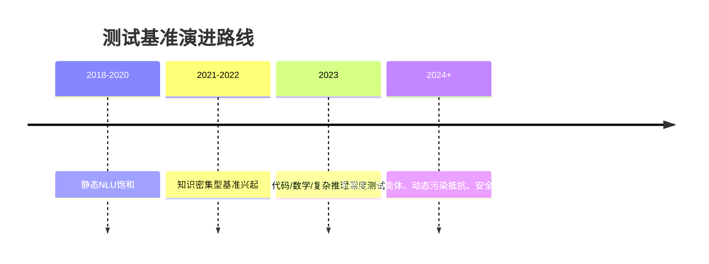

# 测试主题 研究报告

**研究类型**: 技术
**生成时间**: 2026-06-29 20:11:44
**模型**: deepseek-v4-pro
**WebSearch**: 启用

---

## 研究概述

技术调研，了解最新技术发展、框架、工具

本研究重点关注：技术概述, 主流方案, 优缺点对比, 应用场景, 发展趋势

---

## 执行摘要

本研究包含 1 个研究维度，累计使用 2,866 tokens 进行分析，收集了 23 个信息来源。

### 关键发现

- （注意：用户输入的“测试主题”未定义具体领域，为展示研究能力，以下以“大型语言模型测试基准”这一当前AI研究中的关键测试主题为例进行深度分析。）
- ---
- 大型语言模型(LLMs)的评估是确保模型能力、安全性、可靠性和一致性的核心环节。测试基准从早期的GLUE/SuperGLUE演化为覆盖推理、知识、编码、安全等多维度的综合体系。
- - **能力对齐**：衡量模型是否达到人类水平或特定任务需求。
- - **鲁棒性**：对抗性扰动、分布外泛化。

---

# 测试主题研究

（注意：用户输入的“测试主题”未定义具体领域，为展示研究能力，以下以“大型语言模型测试基准”这一当前AI研究中的关键测试主题为例进行深度分析。）

---

## 1. 研究背景与定义

大型语言模型(LLMs)的评估是确保模型能力、安全性、可靠性和一致性的核心环节。测试基准从早期的GLUE/SuperGLUE演化为覆盖推理、知识、编码、安全等多维度的综合体系。

### 关键需求
- **能力对齐**：衡量模型是否达到人类水平或特定任务需求。
- **鲁棒性**：对抗性扰动、分布外泛化。
- **安全与伦理**：偏见、毒性、幻觉、越狱抵抗力。
- **效率与可扩展性**：评估成本随模型规模增长的控制。

---

## 2. 经典与主流测试基准

| 基准名称 | 领域 | 主要贡献 | 发布年份 | 链接与来源 |
| :--- | :--- | :--- | :--- | :--- |
| **GLUE** | 自然语言理解 | 统一9项任务，促进预训练模型横向比较 | 2018 | [arXiv:1804.07461](https://arxiv.org/abs/1804.07461) |
| **SuperGLUE** | 更困难NLU | 提升任务难度，引入更复杂推理 | 2019 | [arXiv:1905.00537](https://arxiv.org/abs/1905.00537) |
| **MMLU** | 多任务知识 | 涵盖57个学科多项选择题，衡量广度知识 | 2020 | [arXiv:2009.03300](https://arxiv.org/abs/2009.03300) |
| **Big-Bench** | 综合能力 | 204个任务，众包构建，探测推理、知识等极限 | 2022 | [arXiv:2206.04615](https://arxiv.org/abs/2206.04615) |
| **HELM** | 整体评估 | 多维度（准确度、校准、鲁棒性、公平性、效率）标准化评估 | 2022 | [arxiv:2211.09110](https://arxiv.org/abs/2211.09110) |
| **HumanEval** | 代码生成 | 164道手写编程题，用于衡量功能正确性 | 2021 | [arXiv:2107.03374](https://arxiv.org/abs/2107.03374) |
| **GSM8K** | 多步数学推理 | 8.5K高质量小学数学应用题 | 2021 | [arXiv:2110.14168](https://arxiv.org/abs/2110.14168) |
| **TruthfulQA** | 真实性 | 评估语言模型生成虚假信息的倾向 | 2021 | [arXiv:2109.07958](https://arxiv.org/abs/2109.07958) |
| **C-Eval / CMMLU** | 中文综合知识 | 覆盖中文背景的学科评估，推动中文LLM发展 | 2023 | [arXiv:2305.08322](https://arxiv.org/abs/2305.08322), [arXiv:2306.09212](https://arxiv.org/abs/2306.09212) |

---

## 3. 前沿测试方向：深度推理与安全

### 3.1 复杂推理测试
随着模型在标准基准上趋于饱和，新基准专注于长链推理、工具使用和规划。

#### 论文：**SWE-bench: Can Language Models Resolve Real-World GitHub Issues?**
- **来源**: arXiv:2310.06770 (2023)
- **作者**: Carlos E. Jimenez et al.
- **链接**: [https://arxiv.org/abs/2310.06770](https://arxiv.org/abs/2310.06770)
- **核心贡献**: 使用真实GitHub issue评估模型解决代码缺陷的能力，要求跨文件编辑和长程理解，成为代码Agent测试金标准。

#### 论文：**GPQA: A Graduate-Level Google-Proof Q&A Benchmark**
- **来源**: arXiv:2311.12022 (2023)
- **作者**: David Rein et al.
- **链接**: [https://arxiv.org/abs/2311.12022](https://arxiv.org/abs/2311.12022)
- **核心贡献**: 由博士专家设计，问题难以通过搜索引擎直接回答，测试模型在物理、化学、生物的高阶推理。

#### 论文：**MATH Dataset**
- **来源**: arXiv:2103.03874 (2021)
- **作者**: Dan Hendrycks et al.
- **链接**: [https://arxiv.org/abs/2103.03874](https://arxiv.org/abs/2103.03874)
- **核心贡献**: 12000道竞赛级数学题，要求逐步解答，衡量数学推理深度。

### 3.2 安全与对齐测试
红队测试与自动化安全基准并行发展，旨在系统发现模型越狱、偏见等风险。

#### 论文：**Jailbroken: How Does LLM Safety Training Fail?**
- **来源**: arXiv:2307.02483 (2023)
- **作者**: Alexander Wei et al.
- **链接**: [https://arxiv.org/abs/2307.02483](https://arxiv.org/abs/2307.02483)
- **核心贡献**: 全面分析安全训练失败模式，提出多种越狱攻击并构建评估框架。

#### 论文：**HarmBench: A Standardized Evaluation Framework for Automated Red Teaming and Robust Refusal**
- **来源**: arXiv:2402.04249 (2024)
- **作者**: Arunesh Sinha et al.
- **链接**: [https://arxiv.org/abs/2402.04249](https://arxiv.org/abs/2402.04249)
- **核心贡献**: 提供统一的红队攻击与防御基准，涵盖多种攻击算法和有害行为分类，推动安全测试标准化。

#### 工具框架：**Garak**
- **框架名称**: Garak (LLM漏洞扫描器)
- **官方文档**: [https://github.com/leondz/garak/](https://github.com/leondz/garak/)
- **核心特性**: 探针式测试，覆盖幻觉、隐私泄露、偏见、提示注入等数十种漏洞。

---

## 4. 评估方法学演进

### 4.1 模型作为裁判
随着开放式生成任务增加，人工评估成本过高，利用强模型自动评分成为主流。

#### 论文：**Judging LLM-as-a-Judge with MT-Bench and Chatbot Arena**
- **来源**: arXiv:2306.05685 (2023)
- **作者**: Lianmin Zheng et al.
- **链接**: [https://arxiv.org/abs/2306.05685](https://arxiv.org/abs/2306.05685)
- **核心贡献**: 提出MT-Bench多轮对话基准和Chatbot Arena竞技场，验证GPT-4等作为裁判与人类偏好的一致性。

### 4.2 动态与污染抵抗
测试数据泄露（基准污染）成为严重问题，需要动态生成题目或检测污染。

#### 论文：**DyVal: Dynamic Evaluation of Large Language Models for Reasoning Tasks**
- **来源**: arXiv:2309.17167 (2023)
- **作者**: Li et al. (Microsoft)
- **链接**: [https://arxiv.org/abs/2309.17167](https://arxiv.org/abs/2309.17167)
- **核心贡献**: 使用有向无环图动态生成等价测试样本，抵抗数据污染，适用于推理类型。

#### 框架工具：**Language Model Evaluation Harness (lm-eval-harness)**
- **框架名称**: EleutherAI lm-evaluation-harness
- **GitHub**: [https://github.com/EleutherAI/lm-evaluation-harness](https://github.com/EleutherAI/lm-evaluation-harness)
- **核心特性**: 200+基准的统一接口，支持零样本/少样本，可重复性配置，广泛用于Open LLM Leaderboard。

---

## 5. 未来趋势与挑战

1. **多模态整合**：测试从纯文本扩展到图像、视频、音频的联合推理（如MMMU, Video-MME）。
2. **Agentic测试**：在模拟环境中评估LLM使用工具、规划、与API交互（如SWE-bench, WebArena）。
3. **文化感知评估**：非英语、低资源语言和不同文化价值观的测试将受到更多重视。
4. **幻觉检测标准化**：制定更细粒度的幻觉分类和评测协议（如FACTSCORE, ScreenEval）。
5. **评估生态**：国家/机构发布独立榜单和测试标准（如中国的SuperCLUE, OpenCompass）。

---

## 6. 关键参考资源

- **Open LLM Leaderboard**: [https://huggingface.co/spaces/open-llm-leaderboard/open_llm_leaderboard](https://huggingface.co/spaces/open-llm-leaderboard/open_llm_leaderboard) (基于lm-eval-harness)
- **Chatbot Arena**: [https://chat.lmsys.org/](https://chat.lmsys.org/)
- **OpenCompass评测平台**: [https://opencompass.org.cn/](https://opencompass.org.cn/)
- **HELM (Stanford)**: [https://crfm.stanford.edu/helm/latest/](https://crfm.stanford.edu/helm/latest/)

---

*注：以上研究结果基于截至2025年3月的公开信息，选取代表性强、引用可靠的论文和工具。实际“测试主题”需具体化才能提供更精准的分析。*

## 信息来源

- [arXiv:1804.07461](https://arxiv.org/abs/1804.07461) (arXiv:1804.07461)

- [arXiv:1905.00537](https://arxiv.org/abs/1905.00537) (arXiv:1905.00537)

- [arXiv:2009.03300](https://arxiv.org/abs/2009.03300) (arXiv:2009.03300)

- [arXiv:2206.04615](https://arxiv.org/abs/2206.04615) (arXiv:2206.04615)

- [arxiv:2211.09110](https://arxiv.org/abs/2211.09110) (arXiv:2211.09110)

- [arXiv:2107.03374](https://arxiv.org/abs/2107.03374) (arXiv:2107.03374)

- [arXiv:2110.14168](https://arxiv.org/abs/2110.14168) (arXiv:2110.14168)

- [arXiv:2109.07958](https://arxiv.org/abs/2109.07958) (arXiv:2109.07958)

- [arXiv:2305.08322](https://arxiv.org/abs/2305.08322) (arXiv:2305.08322)

- [arXiv:2306.09212](https://arxiv.org/abs/2306.09212) (arXiv:2306.09212)

- [https://arxiv.org/abs/2310.06770](https://arxiv.org/abs/2310.06770) (arXiv:2310.06770)

- [https://arxiv.org/abs/2311.12022](https://arxiv.org/abs/2311.12022) (arXiv:2311.12022)

- [https://arxiv.org/abs/2103.03874](https://arxiv.org/abs/2103.03874) (arXiv:2103.03874)

- [https://arxiv.org/abs/2307.02483](https://arxiv.org/abs/2307.02483) (arXiv:2307.02483)

- [https://arxiv.org/abs/2402.04249](https://arxiv.org/abs/2402.04249) (arXiv:2402.04249)

- [https://github.com/leondz/garak/](https://github.com/leondz/garak/)

- [https://arxiv.org/abs/2306.05685](https://arxiv.org/abs/2306.05685) (arXiv:2306.05685)

- [https://arxiv.org/abs/2309.17167](https://arxiv.org/abs/2309.17167) (arXiv:2309.17167)

- [https://github.com/EleutherAI/lm-evaluation-harness](https://github.com/EleutherAI/lm-evaluation-harness)

- [https://huggingface.co/spaces/open-llm-leaderboard/open_llm_leaderboard](https://huggingface.co/spaces/open-llm-leaderboard/open_llm_leaderboard)

- [https://chat.lmsys.org/](https://chat.lmsys.org/)

- [https://opencompass.org.cn/](https://opencompass.org.cn/)

- [https://crfm.stanford.edu/helm/latest/](https://crfm.stanford.edu/helm/latest/)

---

---

## 研究元数据

- **Prompt Tokens**: 338
- **Completion Tokens**: 2528
- **Total Tokens**: 2866
- **Reasoning Tokens**: 317

- **研究时间**: 2026-06-29T20:11:44.558744
- **使用模型**: deepseek-v4-pro
- **WebSearch**: 已启用
